# 数字乡村平台需求说明书（统一版）

| 字段 | 内容 |
|------|------|
| 项目名称 | 数字乡村平台（县/乡/村三级 + 四端） |
| 文档版本 | V2.0 |
| 文档类型 | 产品需求说明书（PRD） |
| 编写日期 | 2026-08-011 |
| 替代版本 | 替代《数字乡村（村级版）需求说明书》V1.0 |
| 文档状态 | 正式发布 |

---

## 目录

- [1. 产品背景](#1-产品背景)
  - [1.1 政策背景](#11-政策背景)
  - [1.2 行业现状与痛点](#12-行业现状与痛点)
  - [1.3 数字化转型需求](#13-数字化转型需求)
- [2. 产品目标](#2-产品目标)
  - [2.1 总体目标](#21-总体目标)
  - [2.2 分级目标](#22-分级目标)
  - [2.3 量化指标](#23-量化指标)
  - [2.4 非目标](#24-非目标)
- [3. 建设范围](#3-建设范围)
  - [3.1 系统总体架构](#31-系统总体架构)
  - [3.2 三级管理边界](#32-三级管理边界)
  - [3.3 七端定位与边界](#33-七端定位与边界)
  - [3.4 功能覆盖范围总表](#34-功能覆盖范围总表)
  - [3.5 与现有原型的对应关系](#35-与现有原型的对应关系)
- [4. 产品用户](#4-产品用户)
  - [4.1 用户角色定义](#41-用户角色定义)
  - [4.2 角色权限矩阵](#42-角色权限矩阵)
  - [4.3 用户使用场景](#43-用户使用场景)
- [5. 业务流程](#5-业务流程)
  - [5.1 乡村开通流程](#51-乡村开通流程)
  - [5.2 党建引领业务流程](#52-党建引领业务流程)
  - [5.3 阳光村务业务流程](#53-阳光村务业务流程)
  - [5.4 基层治理业务流程](#54-基层治理业务流程)
  - [5.5 积分管理业务流程](#55-积分管理业务流程)
  - [5.6 乡村旅游业务流程](#56-乡村旅游业务流程)
  - [5.7 农业认养业务流程](#57-农业认养业务流程)
  - [5.8 表单应用业务流程](#58-表单应用业务流程)
  - [5.9 设备管理业务流程](#59-设备管理业务流程)
  - [5.10 数据管理业务流程](#510-数据管理业务流程)
  - [5.11 千村千面配置流程](#511-千村千面配置流程)
  - [5.12 村民办事服务流程](#512-村民办事服务流程)
- [6. 功能需求（详细）](#6-功能需求详细)
  - [6.1 县级平台功能](#61-县级平台功能)
  - [6.2 乡级平台功能](#62-乡级平台功能)
  - [6.3 村级平台功能](#63-村级平台功能)
  - [6.4 大屏端功能](#64-大屏端功能)
  - [6.5 村民小程序功能](#65-村民小程序功能)
  - [6.6 村干部小程序功能](#66-村干部小程序功能)
  - [6.7 通用功能说明](#67-通用功能说明)
- [7. 数据需求](#7-数据需求)
- [8. 配置要求](#8-配置要求)
- [9. 非功能要求](#9-非功能要求)
- [10. 技术架构](#10-技术架构)
- [11. 运维部署](#11-运维部署)
- [12. 附录](#12-附录)

---

## 1. 产品背景

### 1.1 政策背景

2019年，中共中央办公厅、国务院办公厅印发《数字乡村发展战略纲要》，明确了数字乡村建设的总体架构和阶段性目标，要求加快信息化技术在乡村治理、生产经营、公共服务等领域的应用。2024年，中共中央、国务院发布《乡村全面振兴规划（2024）》，将数字化作为"三农"工作的重要抓手，提出推进智慧农业、数字治理、线上服务三大方向。同年，中央网信办等部门联合印发《数字乡村发展行动计划（2024-2026年）》，设定了行政村5G通达率超90%、农业生产信息化率达40%以上的量化指标。

2024年中央一号文件进一步强调"持续推进数字乡村建设"，要求"深入实施数字乡村发展行动，推动数字技术与乡村振兴深度融合"。国家层面鼓励各地探索"市（县）—乡镇—村"三级联动的数字乡村治理模式，通过统一平台实现向下开通、分级管理、数据贯通。

乡村振兴的总要求概括为二十字方针：**产业兴旺、生态宜居、乡风文明、治理有效、生活富裕**。本平台围绕这五个维度构建乡村数字治理能力，并以"县级统筹、乡级管理、村级落地"的三级体系保障落地。

### 1.2 行业现状与痛点

#### 1.2.1 乡村治理痛点

- **村务公开依赖纸质张贴**：村务公开主要依赖村委会公告栏的纸质张贴，更新周期长，外出务工村民难以及时获取。
- **台账整理耗时**：村干部入户走访、事件巡查、诉求处理等工作缺乏信息化记录手段，月底整理台账通常需要2至3个工作日。
- **产业数据分散**：产业数据（合作社产值、农产品产量、电商销售额等）分散在不同部门和个人手中，村委会没有一个统一的数据汇总渠道。
- **乡风建设缺量化工具**：乡风建设缺少量化评价工具，"文明家庭""好媳妇好婆婆"等评比主要靠主观印象，难以形成持续的激励闭环。

#### 1.2.2 三级管理痛点

- **开通流程繁琐**：市（县）对下辖乡镇、村的数字化开通缺乏统一入口，多靠线下申请、手工建账号，效率低且易出错。
- **数据无法贯通**：县/乡/村三级数据各自孤立，上级无法实时掌握下级运行情况，缺乏统一的数据看板。
- **配置能力弱**：不同乡镇、村的业务侧重不同（如有的重旅游、有的重认养），现有系统多为固定功能，无法按需配置。
- **设备接入分散**：摄像头、小喇叭、监控等物联设备品牌不一（沃家云视、萤石云、乐橙云等），缺乏统一接入和管理。

### 1.3 数字化转型需求

#### 1.3.1 县级需求

- 需要一个统一的开通管理后台，对下辖乡镇、村的数字乡村平台进行开通申请受理、审核、审计。
- 需要管理运营人员队伍，掌握人员情况分析。
- 需要统筹干部信息，向下贯通到乡、村。

#### 1.3.2 乡级需求

- 需要一个乡级管理后台，管理本乡镇概况、名片、网格、机构、建言献策等信息。
- 需要乡级数字大屏，展示本乡镇党建引领、基层治理、经济发展、优政惠民等维度数据。
- 需要管理本乡镇农户信息、公告、信息发布，以及产业数据（6类产业 + 企业）。
- 需要审核下辖村提交的三务公开信息。

#### 1.3.3 村级需求

- 需要一套完整的村级 PC 管理后台，覆盖乡村概况、农户、干部、党建、阳光村务、基层治理、设备、数据、积分、积分超市、千村千面、审核、旅游、认养、表单等 15 个业务模块。
- 需要村级数字看板，展示乡村全景、党建引领、乡村政务、乡村治理、乡村民生、乡村产业 6 个维度。
- 村民需要线上渠道查看村务信息、办理日常事务、参与村庄事务讨论。
- 村干部需要移动办公工具来接收任务、上报巡查记录、处理村民诉求、发布通知。
- 村委会需要数据可视化展示窗口，向上级领导和来访人员直观呈现村庄发展状况。

#### 1.3.4 通用性与配置性需求

- 平台需具备**较大通用性**：同一套系统可向下开通给不同乡镇、村使用，业务模块可复用。
- 平台需具备**较大配置性**：村级首页和更多页面可通过"千村千面"设计器自定义配置；积分规则、表单、设备接入等均可按村配置。

---

## 2. 产品目标

### 2.1 总体目标

搭建一套覆盖**市（县）—乡镇—村**三级联动的数字乡村平台，实现：

1. **向下开通**：县级可对下辖乡镇、村进行平台开通申请受理、审核、审计，开通后乡镇/村获得独立管理员账号自主使用。
2. **分级管理**：三级各有独立管理后台，数据按行政区划隔离，上级可查看下级汇总。
3. **四端协同**：村级层面配套大屏端、PC 管理端、村民小程序、村干部小程序，覆盖展示、管理、服务、移动办公全场景。
4. **通用可配**：同一套平台支撑多村部署，通过"千村千面"设计器、积分规则配置、表单配置、设备接入配置等实现按需定制。

### 2.2 分级目标

#### 2.2.1 县级目标

| 目标项 | 指标 |
|--------|------|
| 开通效率 | 乡镇/村开通申请从受理到开通账号平均时长不超过 3 个工作日 |
| 审核覆盖 | 开通审核、开通审计 100% 线上留痕 |
| 人员管理 | 运营人员、干部信息 100% 入库，支持人员情况分析 |

#### 2.2.2 乡级目标

| 目标项 | 指标 |
|--------|------|
| 大屏覆盖 | 乡镇数字大屏 6 个维度页面 100% 上线 |
| 数据入库 | 本乡镇农户信息、产业数据（6类+企业）覆盖率不低于 90% |
| 三务审核 | 下辖村提交的三务公开信息审核及时率不低于 95% |

#### 2.2.3 村级目标

| 维度 | 目标指标 |
|------|----------|
| 产业兴旺 | 村内合作社、企业、种养大户信息全部入库；产业数据按季度更新，覆盖率不低于90% |
| 生态宜居 | 环境事件（垃圾乱堆、污水直排等）从村民上报到干部确认处置的闭环率不低于85% |
| 乡风文明 | 积分制参与家庭户数占全村常住户数的比例不低于60%；积分兑换率不低于50% |
| 治理有效 | 村务公开内容100%线上发布；村民上报事件平均处置时长不超过48小时 |
| 生活富裕 | 村民线上办事申请比例不低于30%；常见办事事项可通过小程序提交 |

### 2.3 量化指标

| 指标类别 | 指标项 | 目标值 |
|----------|--------|--------|
| 开通 | 乡镇/村开通数 | 覆盖县域内全部乡镇及 80% 以上行政村 |
| 使用 | 日活村级管理员 | 不低于开通村数的 70% |
| 使用 | 村民小程序注册率 | 不低于全村常住人口 60% |
| 数据 | 农户信息入库率 | 不低于 95% |
| 数据 | 产业数据更新频率 | 季度更新 |
| 治理 | 事件处置闭环率 | 不低于 85% |
| 治理 | 事件平均处置时长 | 不超过 48 小时 |
| 积分 | 积分参与率 | 不低于 60% |
| 积分 | 积分兑换率 | 不低于 50% |
| 公开 | 三务公开线上发布率 | 100% |

### 2.4 非目标

本平台在当前版本中不涉及以下内容：

- 不对接省级/国家级政务数据平台，不做跨部门数据互通
- 不包含农业生产物联网设备（传感器等）的直接接入，仅支持摄像头、小喇叭等监控类设备的账号绑定接入
- 不做村民线上缴费、线上交易等涉及资金流转的功能（认养订单仅记录订单状态，不在线支付）
- 不做村干部绩效考核的自动化评分，仅提供工作记录和统计数据作为参考依据
- 不做县级跨乡镇的业务审批流转，县级仅负责开通管理和统筹查看

---

## 3. 建设范围

### 3.1 系统总体架构

系统采用"**三级 + 四端 + N 模块**"架构模式：

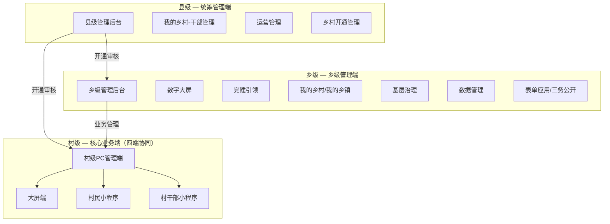

**架构说明**：

- **县级**：统筹管理端，通过"乡村开通管理"向下开通乡镇和村，开通后乡镇/村获得独立管理员账号。
- **乡级**：乡级管理端，管理本乡镇业务，可查看下辖村汇总数据，审核村级三务公开。
- **村级**：核心业务端，配套四端（PC 管理端 + 大屏端 + 村民小程序 + 村干部小程序），村是最小业务单位，数据归属村。
- **N 模块**：村级涵盖 15 个一级业务模块，乡级 9 个，县级 4 个，模块可复用、可配置。

### 3.2 三级管理边界

| 层级 | 管理边界 | 数据权限 | 开通权限 |
|------|----------|----------|----------|
| 县级 | 管理全县运营人员、干部；受理乡镇/村开通申请、审核、审计 | 可查看全县所有乡镇、村汇总数据 | 可开通乡镇、村 |
| 乡级 | 管理本乡镇概况、网格、机构、农户、党建、产业、事件；审核下辖村三务公开 | 可查看本乡镇及下辖村数据 | 不可开通下级 |
| 村级 | 管理本村全部 15 个业务模块；是最小业务单位 | 仅可查看/管理本村数据 | 不可开通下级 |

### 3.3 七端定位与边界

| 端 | 使用形态 | 面向角色 | 核心定位 |
|----|----------|----------|----------|
| 县级管理端 | PC 浏览器 Web 应用 | 县级运营人员 | 开通管理、运营人员管理、干部管理、人员分析 |
| 乡级管理端 | PC 浏览器 Web 应用 | 乡级管理员 | 乡镇业务管理、数字大屏、三务审核 |
| 村级 PC 管理端 | PC 浏览器 Web 应用 | 村级管理员 | 本村 15 个业务模块的完整管理 |
| 大屏端 | 村委/乡镇大厅大屏（1920x1080 横屏） | 村干部、来访领导、乡级领导 | 数据可视化展示，6 个维度看板 |
| 村民小程序 | 微信小程序 | 全体村民 | 日常服务与村务参与，查看公开、办事、积分、说事、随手拍 |
| 村干部小程序 | 微信小程序 | 村干部 | 移动办公，任务、巡查、通知、积分审核、诉求处理、日志 |
| 运营管理端 | PC 浏览器（县级运营） | 县级运营人员 | 宽带检测等运营支撑功能 |

### 3.4 功能覆盖范围总表

| # | 层级/端 | 一级模块 | 二级功能数 | 优先级 |
|---|---------|----------|-----------|--------|
| 1 | 县级 | 首页 | 1 | P0 |
| 2 | 县级 | 我的乡村（干部管理） | 1 | P0 |
| 3 | 县级 | 运营管理 | 2 | P0 |
| 4 | 县级 | 乡村开通管理 | 3 | P0 |
| 5 | 乡级 | 首页 | 1 | P0 |
| 6 | 乡级 | 数字大屏 | 6 | P0 |
| 7 | 乡级 | 党建引领 | 6 | P0 |
| 8 | 乡级 | 我的乡村 | 4 | P0 |
| 9 | 乡级 | 我的乡镇 | 6 | P0 |
| 10 | 乡级 | 基层治理 | 1 | P0 |
| 11 | 乡级 | 数据管理 | 7 | P0 |
| 12 | 乡级 | 乡村旅游 | 1 | P1 |
| 13 | 乡级 | 表单应用 | 5 | P1 |
| 14 | 乡级 | 三务公开 | 1 | P0 |
| 15 | 村级 | 首页 | 1 | P0 |
| 16 | 村级 | 数字看板 | 6 | P0 |
| 17 | 村级 | 党建引领 | 2 | P0 |
| 18 | 村级 | 我的乡村 | 13 | P0 |
| 19 | 村级 | 阳光村务 | 3 | P0 |
| 20 | 村级 | 基层治理 | 4 | P0 |
| 21 | 村级 | 设备管理 | 5 | P0 |
| 22 | 村级 | 数据管理 | 8 | P0 |
| 23 | 村级 | 积分管理 | 3 | P0 |
| 24 | 村级 | 积分超市 | 3 | P0 |
| 25 | 村级 | 千村千面 | 2 | P1 |
| 26 | 村级 | 审核管理 | 2 | P1 |
| 27 | 村级 | 乡村旅游 | 3 | P1 |
| 28 | 村级 | 运营管理 | 1 | P1 |
| 29 | 村级 | 农业认养 | 6 | P1 |
| 30 | 村级 | 表单应用 | 5 | P1 |
| 31 | 大屏端 | 6 维度看板 | 6 | P0 |
| 32 | 村民小程序 | 7 模块 | 7 | P0 |
| 33 | 村干部小程序 | 8 模块 | 8 | P0 |

### 3.5 与现有原型的对应关系

| 现有原型目录 | 对应需求章节 | 整合说明 |
|-------------|-------------|---------|
| `html/admin/` | 6.3 村级平台功能 | 村级 PC 管理端原型，截图功能更全，以截图为准补充 |
| `html/dashboard/` | 6.4 大屏端功能 | 大屏端原型，整合乡级数字大屏和村级数字看板 |
| `html/villager/` | 6.5 村民小程序功能 | 村民小程序原型，完整纳入 |
| `html/cadre/` | 6.6 村干部小程序功能 | 村干部小程序原型，完整纳入 |
| `html/shared/` | 10.2 前端架构 | 共享 Design Tokens，技术架构参考 |

---

## 4. 产品用户

### 4.1 用户角色定义

| 角色 | 所属层级 | 可使用端 | 核心场景 |
|------|----------|----------|----------|
| 县级运营人员 | 县级 | 县级管理端 | 受理乡镇/村开通申请、审核、审计；管理运营人员；查看人员分析 |
| 乡级管理员 | 乡级 | 乡级管理端 | 管理本乡镇概况、网格、机构、农户、党建、产业、事件；审核村级三务公开 |
| 村级管理员 | 村级 | 村级 PC 管理端 | 管理本村全部 15 个业务模块；配置千村千面、积分规则、表单等 |
| 村干部 | 村级 | 村干部小程序 + 大屏端 | 执行巡查任务、处理村民事件/诉求、发布通知、审核积分、填写工作日志 |
| 村民 | 村级 | 村民小程序 + 大屏端（仅查看） | 查看村务公开、提交办事申请、参与村民说事、上报问题、查看和兑换积分 |
| 系统管理员 | 平台级 | 各级管理端 | 管理用户账号、角色权限、系统参数、数据字典（通常由县级运营人员兼任） |

### 4.2 角色权限矩阵

| 功能模块 | 县级运营 | 乡级管理员 | 村级管理员 | 村干部 | 村民 |
|----------|---------|-----------|-----------|--------|------|
| 乡村开通管理 | ✅ 全部 | ❌ | ❌ | ❌ | ❌ |
| 运营人员管理 | ✅ 全部 | ❌ | ❌ | ❌ | ❌ |
| 人员情况分析 | ✅ 查看 | ❌ | ❌ | ❌ | ❌ |
| 干部管理（县级） | ✅ 全部 | ❌ | ❌ | ❌ | ❌ |
| 乡镇数字大屏 | ✅ 查看汇总 | ✅ 本乡镇 | ❌ | ❌ | ❌ |
| 乡镇概况/名片/网格/机构 | ❌ | ✅ 本乡镇 | ❌ | ❌ | ❌ |
| 三务公开审核 | ❌ | ✅ 审核下辖村 | ❌ | ❌ | ❌ |
| 村级数字看板 | ✅ 查看汇总 | ✅ 查看下辖村 | ✅ 本村 | ✅ 查看 | ✅ 查看 |
| 乡村概况/名片 | ❌ | ✅ 查看 | ✅ 管理 | ❌ | ❌ |
| 农户管理 | ❌ | ✅ 查看 | ✅ 管理 | ❌ | ❌ |
| 干部管理（村级） | ❌ | ✅ 查看 | ✅ 管理 | ❌ | ❌ |
| 党建引领 | ❌ | ✅ 管理 | ✅ 管理 | ✅ 部分操作 | ❌ |
| 阳光村务 | ❌ | ✅ 审核 | ✅ 管理 | ❌ | ✅ 查看 |
| 基层治理 | ❌ | ✅ 管理 | ✅ 管理 | ✅ 执行 | ✅ 上报 |
| 设备管理 | ❌ | ❌ | ✅ 管理 | ✅ 查看 | ❌ |
| 数据管理（产业/房屋/土地） | ❌ | ✅ 产业管理 | ✅ 全部 | ❌ | ❌ |
| 积分管理 | ❌ | ❌ | ✅ 管理 | ✅ 审核 | ✅ 查看 |
| 积分超市 | ❌ | ❌ | ✅ 管理 | ❌ | ✅ 兑换 |
| 千村千面 | ❌ | ❌ | ✅ 配置 | ❌ | ❌ |
| 审核管理 | ❌ | ❌ | ✅ 管理 | ❌ | ❌ |
| 乡村旅游 | ❌ | ✅ 查看旅游村 | ✅ 管理 | ❌ | ❌ |
| 农业认养 | ❌ | ❌ | ✅ 管理 | ❌ | ❌ |
| 表单应用 | ❌ | ✅ 管理 | ✅ 管理 | ✅ 经办 | ❌ |
| 村民办事 | ❌ | ❌ | ❌ | ✅ 处理 | ✅ 申请 |

### 4.3 用户使用场景

#### 场景 1：县级运营人员开通新村

县级运营人员登录县级管理端 → 进入"乡村开通管理" → 查看乡村开通申请列表 → 受理某村提交的开通申请 → 填写审核意见 → 审核通过后该村获得管理员账号 → 开通审计记录留痕。

#### 场景 2：乡级管理员审核村级三务公开

乡级管理员登录乡级管理端 → 进入"三务公开 - 信息审核" → 查看待审核的村级三务公开内容 → 审核通过/驳回 → 驳回时填写驳回原因 → 村级管理员收到驳回消息后修改重新提交。

#### 场景 3：村级管理员配置千村千面首页

村级管理员登录村级 PC 管理端 → 进入"千村千面 - 首页设计器" → 拖拽组件（轮播图、快捷入口、村务公开、积分榜等）到画布 → 配置组件数据源和样式 → 保存发布 → 村民小程序首页同步更新。

#### 场景 4：村民通过小程序办事 + 积分兑换

村民打开村民小程序 → 在首页点击"办事服务" → 选择办事指南 → 提交办事申请 → 等待村干部处理 → 办事完成后获得积分 → 进入"积分中心" → 在积分商城选择商品 → 提交兑换 → 等待村干部发放商品。

#### 场景 5：村干部移动办公闭环

村干部打开村干部小程序 → 在工作台查看待办（待处理事件 3 项、待审核积分 5 项）→ 点击"待处理事件" → 查看事件详情 → 现场处置 → 上传处置照片 → 提交处置结果 → 事件状态变更为"已办结"。

---

## 5. 业务流程

### 5.1 乡村开通流程

乡村开通是县级统筹管理的核心流程，覆盖乡镇开通和村开通两条线，包含申请、审核、审计、开通账号四个环节。

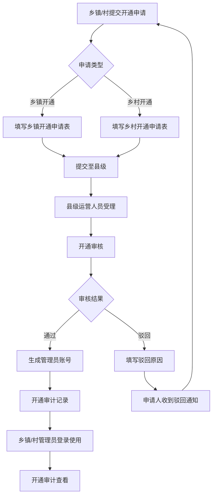

**流程说明**：

| 环节 | 操作角色 | 关键动作 | 产出 |
|------|----------|----------|------|
| 申请 | 乡镇/村申请人 | 填写开通申请表（行政区划、联系人、管理范围等） | 开通申请记录 |
| 受理 | 县级运营人员 | 查看申请列表，受理申请 | 受理状态变更 |
| 审核 | 县级运营人员 | 审核申请信息，填写审核意见（通过/驳回） | 审核记录 |
| 开通 | 系统 | 审核通过后自动生成管理员账号 | 账号密码 |
| 审计 | 县级运营人员 | 查看开通审计记录，可修改备注 | 审计记录 |

### 5.2 党建引领业务流程

党建引领覆盖信息发布、党组织管理、党员管理、党委会议、三会一课、党委班子 6 个子模块（乡级完整，村级精简为信息发布 + 党员管理）。

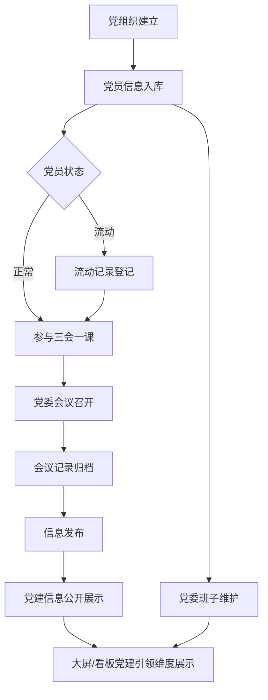

**流程说明**：

| 环节 | 操作角色 | 关键动作 |
|------|----------|----------|
| 党组织建立 | 乡级管理员 | 维护党组织架构（新增/修改） |
| 党员入库 | 乡级管理员 | 党员信息新增/导入，支持流动记录 |
| 三会一课 | 乡级管理员 | 记录三会一课召开情况（新增/修改） |
| 党委会议 | 乡级管理员 | 记录党委会议信息 |
| 党委班子 | 乡级管理员 | 维护党委班子成员 |
| 信息发布 | 乡级/村级管理员 | 发布党建信息，公开展示 |

### 5.3 阳光村务业务流程

阳光村务包含三务公开（党务/村务/财务）、四议两公开、办事指南三个子模块。

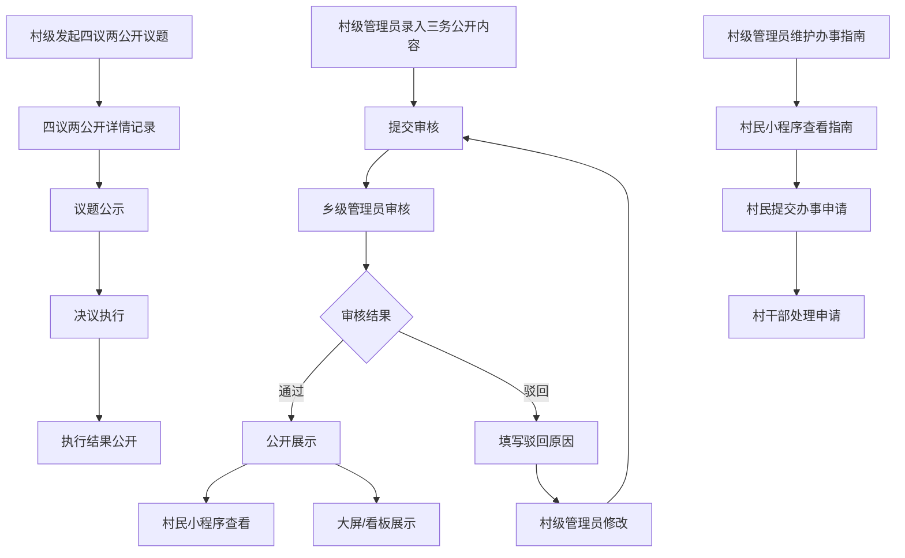

**流程说明**：

| 环节 | 操作角色 | 关键动作 |
|------|----------|----------|
| 三务公开录入 | 村级管理员 | 录入党务/村务/财务公开内容 |
| 三务公开审核 | 乡级管理员 | 审核村级提交的三务公开内容 |
| 四议两公开 | 村级管理员 | 发起议题、记录详情、公示、决议执行 |
| 办事指南 | 村级管理员 | 维护办事指南内容 |
| 办事申请 | 村民 | 通过小程序提交办事申请 |
| 办事处理 | 村干部 | 处理村民办事申请 |

### 5.4 基层治理业务流程

基层治理包含微网格、矛盾调节、外出务工登记、事件上报四个子模块。

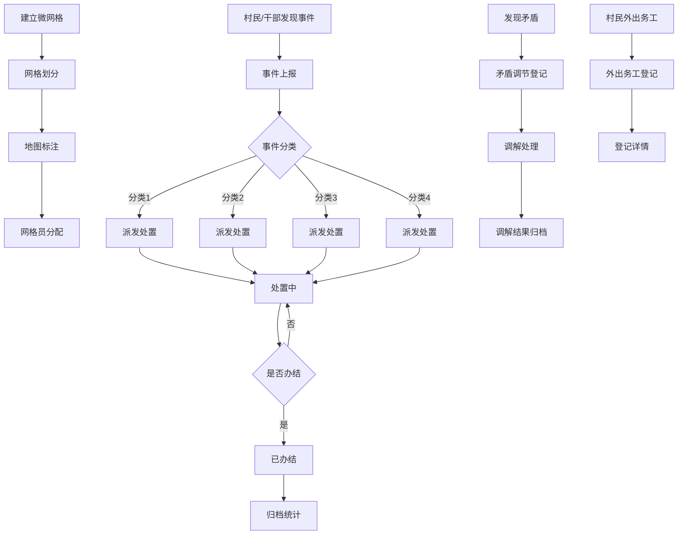

**流程说明**：

| 环节 | 操作角色 | 关键动作 |
|------|----------|----------|
| 微网格建立 | 村级管理员 | 建立微网格、网格划分、地图标注 |
| 事件上报 | 村民/村干部/村级管理员 | 按分类（4类）上报事件 |
| 事件处置 | 村干部/村级管理员 | 派发、处置、办结 |
| 矛盾调节 | 村级管理员 | 登记矛盾、调解处理、归档 |
| 外出务工登记 | 村级管理员 | 登记外出务工人员信息 |

### 5.5 积分管理业务流程

积分管理包含积分规则配置、积分审核人员、积分明细三个子模块，与积分超市形成闭环。

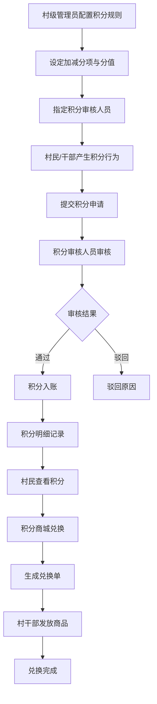

**流程说明**：

| 环节 | 操作角色 | 关键动作 |
|------|----------|----------|
| 规则配置 | 村级管理员 | 配置积分加减分项、分值，支持导入 |
| 审核人员指定 | 村级管理员 | 指定积分审核人员 |
| 积分产生 | 村民/村干部 | 产生积分行为，提交申请 |
| 积分审核 | 积分审核人员 | 审核积分申请 |
| 积分明细 | 系统 | 记录积分明细，可查看详情 |
| 积分兑换 | 村民 | 在积分商城选择商品兑换 |
| 兑换发放 | 村干部 | 处理兑换单，发放商品 |

### 5.6 乡村旅游业务流程

乡村旅游包含旅游村开通、旅游资源管理、景点管理三个子模块。

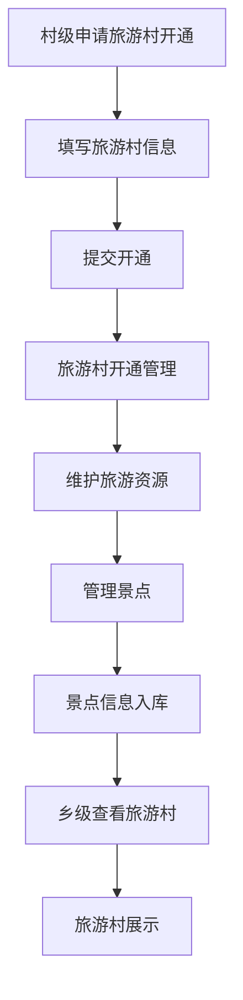

**流程说明**：

| 环节 | 操作角色 | 关键动作 |
|------|----------|----------|
| 旅游村开通 | 村级管理员 | 申请开通、填写信息、查看详情 |
| 旅游资源管理 | 村级管理员 | 维护旅游资源信息 |
| 景点管理 | 村级管理员 | 景点新增/修改/导入 |
| 旅游村查看 | 乡级管理员 | 查看下辖旅游村详情 |

### 5.7 农业认养业务流程

农业认养包含认养开通、认养品类、认养订单、认养养护记录、认养预约记录、监视器信息六个子模块，是最完整的订单流转流程。

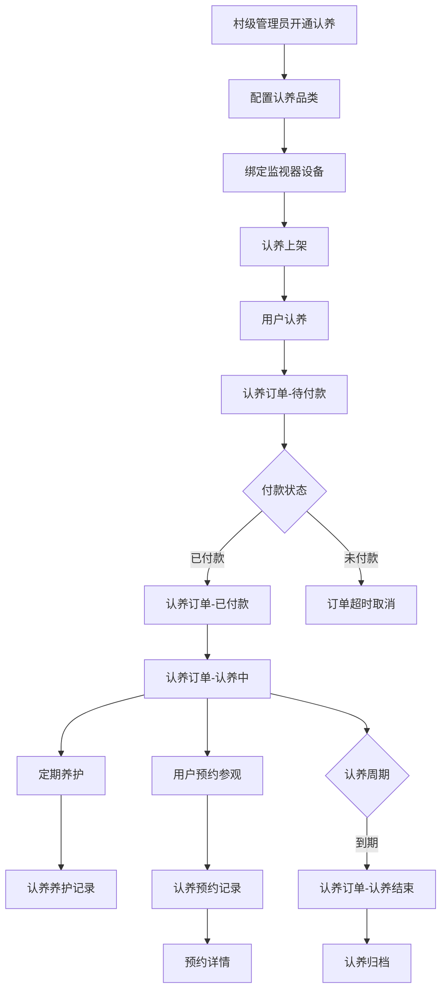

**流程说明**：

| 环节 | 操作角色 | 关键动作 |
|------|----------|----------|
| 认养开通 | 村级管理员 | 开通认养功能 |
| 认养品类 | 村级管理员 | 配置认养品类（如果树、家禽等） |
| 监视器绑定 | 村级管理员 | 绑定摄像头等监视设备 |
| 认养下单 | 用户 | 选择品类下单 |
| 订单流转 | 系统 | 待付款→已付款→认养中→认养结束 |
| 养护记录 | 村级管理员 | 定期记录养护情况 |
| 预约参观 | 用户 | 预约现场参观 |

### 5.8 表单应用业务流程

表单应用包含创建表单、工作表单（我发布的/我的经办）、表单应用、回收站、签章管理五个子模块，乡级和村级均有。

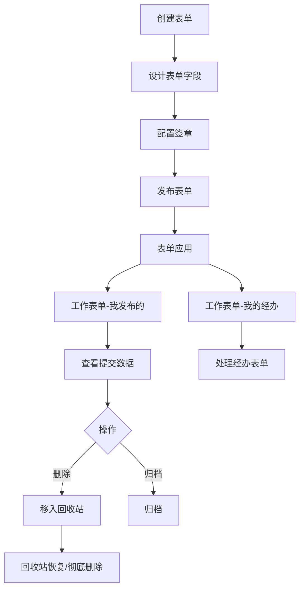

**流程说明**：

| 环节 | 操作角色 | 关键动作 |
|------|----------|----------|
| 创建表单 | 乡级/村级管理员 | 设计表单字段、配置签章 |
| 表单发布 | 乡级/村级管理员 | 发布表单供使用 |
| 我发布的 | 乡级/村级管理员 | 查看自己发布的表单及提交数据 |
| 我的经办 | 乡级/村级管理员 | 处理需经办的表单 |
| 回收站 | 乡级/村级管理员 | 恢复或彻底删除表单 |
| 签章管理 | 乡级/村级管理员 | 管理表单签章 |

### 5.9 设备管理业务流程

设备管理包含沃家云视、雁飞、小喇叭、萤石云、乐橙云五类设备的接入和管理。

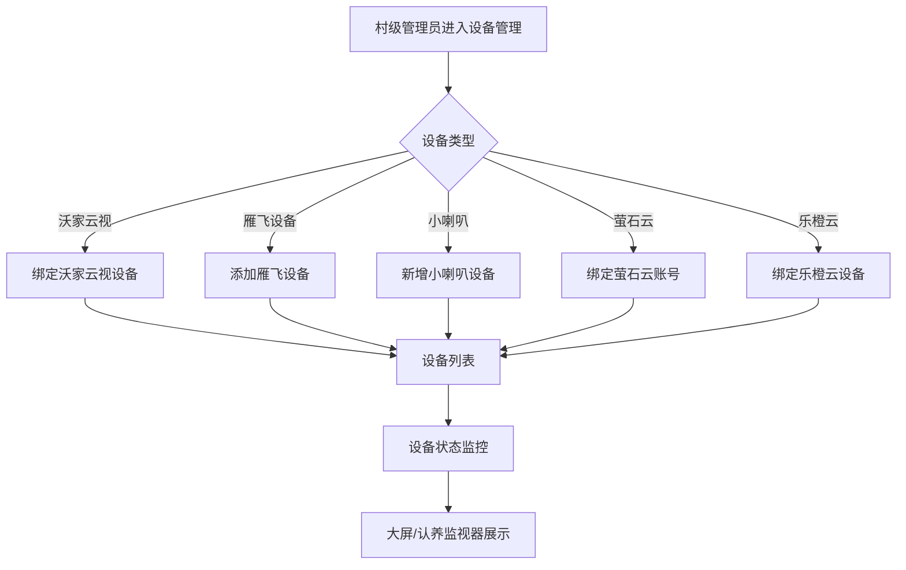

**流程说明**：

| 环节 | 操作角色 | 关键动作 |
|------|----------|----------|
| 设备绑定 | 村级管理员 | 按品牌绑定设备/账号 |
| 设备列表 | 村级管理员 | 查看设备列表、状态 |
| 设备监控 | 系统 | 实时监控设备状态 |
| 设备展示 | 村干部/村民 | 大屏展示、认养监视器查看 |

### 5.10 数据管理业务流程

数据管理包含产业管理（6类）、房屋管理、土地管理、企业管理，是村级和乡级共享的数据底座。

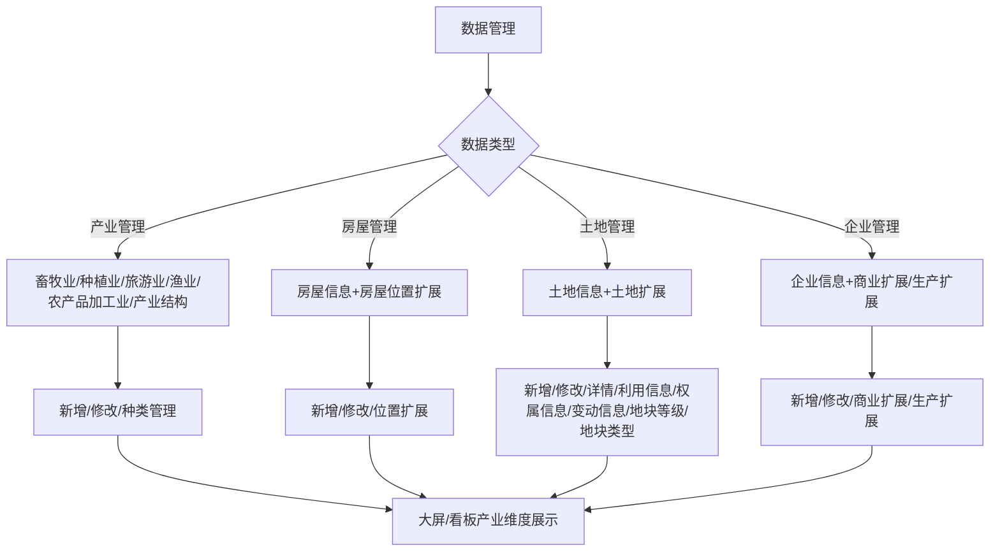

**流程说明**：

| 环节 | 操作角色 | 关键动作 |
|------|----------|----------|
| 产业管理 | 乡级/村级管理员 | 6 类产业数据 CRUD + 种类管理 |
| 房屋管理 | 村级管理员 | 房屋信息 + 房屋位置扩展信息 |
| 土地管理 | 村级管理员 | 土地信息 + 利用/权属/变动扩展 + 地块等级/类型 |
| 企业管理 | 乡级管理员 | 企业信息 + 商业/生产扩展信息 |
| 数据展示 | 系统 | 大屏/看板产业维度展示 |

### 5.11 千村千面配置流程

千村千面是平台"配置性"的核心体现，包含首页设计器和更多页面设计器。

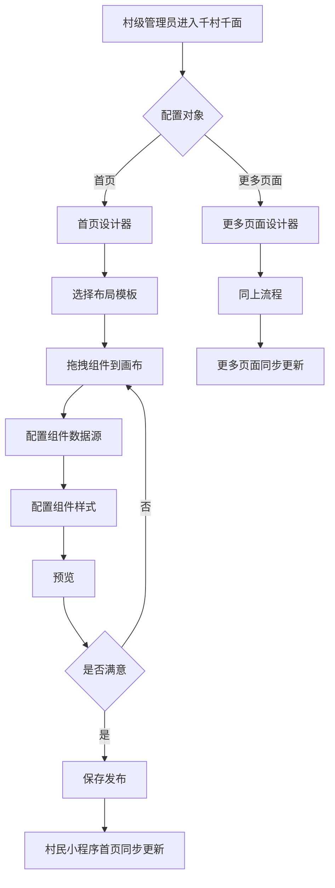

**流程说明**：

| 环节 | 操作角色 | 关键动作 |
|------|----------|----------|
| 进入设计器 | 村级管理员 | 选择首页或更多页面设计器 |
| 布局选择 | 村级管理员 | 选择布局模板 |
| 组件拖拽 | 村级管理员 | 拖拽组件（轮播、入口、列表、图表等）到画布 |
| 数据配置 | 村级管理员 | 配置组件数据源和样式 |
| 预览发布 | 村级管理员 | 预览效果，保存发布 |
| 同步更新 | 系统 | 村民小程序首页/更多页面同步更新 |

### 5.12 村民办事服务流程

村民办事服务覆盖村民小程序办事申请到村干部处理的全闭环。

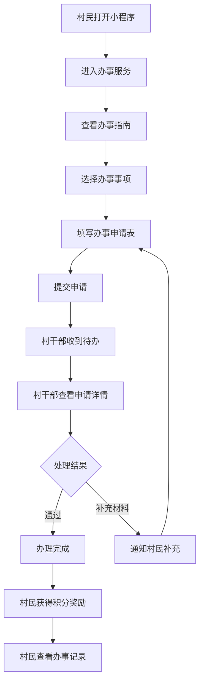

**流程说明**：

| 环节 | 操作角色 | 关键动作 |
|------|----------|----------|
| 查看指南 | 村民 | 查看办事指南列表和详情 |
| 提交申请 | 村民 | 填写并提交办事申请 |
| 待办通知 | 系统 | 推送待办给村干部 |
| 申请处理 | 村干部 | 查看详情、通过/驳回/补充 |
| 积分奖励 | 系统 | 办事完成后给予积分 |
| 记录查看 | 村民 | 查看我的办事记录 |

---

## 6. 功能需求（详细）

### 6.1 县级平台功能

县级平台是统筹管理端，面向县级运营人员，包含首页、我的乡村（干部管理）、运营管理、乡村开通管理 4 个一级模块。

#### 6.1.1 首页

**功能说明**：县级运营人员登录后的工作台首页，展示开通统计、待办事项、运营概览等核心数据。

**操作角色**：县级运营人员

**核心内容**：

| 内容区 | 说明 |
|--------|------|
| 开通统计 | 已开通乡镇数、已开通村数、待审核申请数 |
| 待办事项 | 待审核的开通申请、待审计记录 |
| 运营概览 | 运营人员总数、人员情况概览 |
| 快捷入口 | 乡村开通管理、运营人员管理、干部管理 |

**业务规则**：首页数据实时统计，待办数量实时更新。

**对应截图**：`1-县级/首页.png`

---

#### 6.1.2 我的乡村 - 干部管理

**功能说明**：管理全县干部信息，支持列表查看、新增、修改、导入操作。

**操作角色**：县级运营人员

**核心字段清单**：

| 字段名 | 类型 | 必填 | 说明 |
|--------|------|------|------|
| 姓名 | 文本 | 是 | — |
| 性别 | 枚举 | 是 | 男/女 |
| 手机号 | 手机号 | 是 | 唯一 |
| 所属乡镇/村 | 级联 | 是 | 行政区划选择 |
| 职务 | 文本 | 是 | — |
| 职级 | 枚举 | 否 | — |
| 入职日期 | 日期 | 是 | — |
| 状态 | 枚举 | 是 | 在职/离任 |
| 头像 | 图片 | 否 | — |
| 备注 | 文本 | 否 | — |

**业务规则**：
- 干部信息按行政区划归属，可关联到具体乡镇或村。
- 手机号唯一，不可重复。
- 离任干部状态变更后保留记录，不计入在职统计。
- 支持Excel批量导入，导入时校验手机号格式和行政区划有效性。

**交互说明**：
- 列表支持按姓名、手机号、所属乡镇/村、状态筛选。
- 支持分页，默认每页 20 条。
- 新增/修改通过弹窗表单操作。
- 导入提供模板下载，导入后显示成功/失败条数。

**对应截图**：`1-县级/1-我的乡村/干部管理.png`、`干部管理-新增.png`、`干部管理-修改.png`、`干部管理-导入.png`

---

#### 6.1.3 运营管理 - 运营人员管理

**功能说明**：管理县级运营人员账号，支持列表查看、新增、修改操作。

**操作角色**：县级运营人员（管理员）

**核心字段清单**：

| 字段名 | 类型 | 必填 | 说明 |
|--------|------|------|------|
| 姓名 | 文本 | 是 | — |
| 账号 | 文本 | 是 | 唯一，登录用 |
| 手机号 | 手机号 | 是 | 唯一 |
| 角色 | 枚举 | 是 | 管理员/操作员 |
| 负责区域 | 级联 | 否 | 负责的乡镇/村范围 |
| 状态 | 枚举 | 是 | 启用/停用 |
| 创建时间 | 日期时间 | 是 | 系统自动 |

**业务规则**：
- 账号唯一，创建后不可修改。
- 管理员角色可管理所有运营人员，操作员仅可查看。
- 停用账号后无法登录，但保留操作记录。

**交互说明**：
- 列表支持按姓名、账号、角色、状态筛选。
- 新增/修改通过弹窗表单。
- 停用操作需二次确认。

**对应截图**：`1-县级/2-运营管理/1-运营人员管理.png`、`1-运营人员管理-新增.png`、`1-运营人员管理-修改.png`

---

#### 6.1.4 运营管理 - 人员情况分析

**功能说明**：以图表形式展示运营人员情况分析，辅助县级统筹决策。

**操作角色**：县级运营人员

**核心内容**：

| 图表 | 说明 |
|------|------|
| 人员情况分析图表1 | 按区域分布的运营人员数量统计 |
| 人员情况分析图表2 | 按角色/状态的运营人员构成分析 |

**业务规则**：图表数据实时统计，支持下钻查看明细。

**对应截图**：`1-县级/2-运营管理/2-人员情况分析图表1.png`、`2-人员情况分析图表2.png`

---

#### 6.1.5 乡村开通管理 - 村镇开通申请

**功能说明**：受理乡镇开通申请和乡村开通申请，是向下开通的入口。分为乡镇开通申请和乡村开通申请两类。

**操作角色**：县级运营人员

##### 6.1.5.1 乡村开通申请

**核心字段清单**：

| 字段名 | 类型 | 必填 | 说明 |
|--------|------|------|------|
| 申请村名称 | 文本 | 是 | — |
| 所属乡镇 | 级联 | 是 | — |
| 申请人姓名 | 文本 | 是 | — |
| 申请人手机号 | 手机号 | 是 | — |
| 申请理由 | 文本 | 是 | — |
| 预计管理范围 | 文本 | 否 | — |
| 申请日期 | 日期 | 是 | 系统自动 |
| 申请状态 | 枚举 | 是 | 待受理/受理中/已审核/已驳回 |
| 审核意见 | 文本 | 否 | 审核时填写 |

**业务规则**：
- 村提交开通申请后，状态为"待受理"。
- 县级运营人员受理后状态变更为"受理中"。
- 审核通过后自动生成村级管理员账号，状态变更为"已审核"。
- 审核驳回需填写驳回原因，申请人可修改后重新提交。

**交互说明**：
- 列表支持按申请状态、所属乡镇、申请日期筛选。
- 新增通过弹窗表单。
- 查看详情展示完整申请信息和审核记录。

**对应截图**：`1-县级/3-乡村开通管理/1-村镇开通管理-1乡村开通申请.png`、`1乡村开通申请-新增.png`、`1乡村开通申请-查看.png`

##### 6.1.5.2 乡镇开通申请

**核心字段清单**：

| 字段名 | 类型 | 必填 | 说明 |
|--------|------|------|------|
| 申请乡镇名称 | 文本 | 是 | — |
| 申请人姓名 | 文本 | 是 | — |
| 申请人手机号 | 手机号 | 是 | — |
| 申请理由 | 文本 | 是 | — |
| 下辖村数量 | 数字 | 否 | — |
| 申请日期 | 日期 | 是 | 系统自动 |
| 申请状态 | 枚举 | 是 | 待受理/受理中/已审核/已驳回 |
| 审核意见 | 文本 | 否 | 审核时填写 |

**业务规则**：同乡村开通申请，审核通过后生成乡级管理员账号。

**对应截图**：`1-县级/3-乡村开通管理/1-村镇开通管理-2乡镇开通申请.png`、`2乡镇开通申请-新增.png`、`2乡镇开通申请-查看.png`

---

#### 6.1.6 乡村开通管理 - 开通审核

**功能说明**：对已受理的开通申请进行审核，决定是否开通。

**操作角色**：县级运营人员

**核心字段清单**：

| 字段名 | 类型 | 必填 | 说明 |
|--------|------|------|------|
| 关联申请 | 关联 | 是 | 关联开通申请记录 |
| 审核人 | 文本 | 是 | 系统自动（当前登录人） |
| 审核结果 | 枚举 | 是 | 通过/驳回 |
| 审核意见 | 文本 | 驳回时必填 | — |
| 审核日期 | 日期时间 | 是 | 系统自动 |
| 生成账号 | 文本 | 通过时生成 | 自动生成管理员账号 |

**业务规则**：
- 审核通过后系统自动生成管理员账号，并通过短信通知申请人。
- 审核驳回需填写驳回原因，申请人收到通知后可修改重新提交。
- 审核记录不可删除，永久留痕。

**交互说明**：
- 列表展示待审核、已审核记录，支持按状态筛选。
- 审核操作通过弹窗，填写审核结果和意见。
- 查看详情展示关联申请信息和审核结果。

**对应截图**：`1-县级/3-乡村开通管理/2-开通审核.png`、`2-开通审核-新增.png`、`2-开通审核-查看.png`

---

#### 6.1.7 乡村开通管理 - 开通审计

**功能说明**：记录和审计所有开通操作，支持查看和修改备注。

**操作角色**：县级运营人员

**核心字段清单**：

| 字段名 | 类型 | 必填 | 说明 |
|--------|------|------|------|
| 审计记录ID | 文本 | 是 | 系统自动 |
| 开通对象 | 文本 | 是 | 乡镇/村名称 |
| 开通类型 | 枚举 | 是 | 乡镇开通/乡村开通 |
| 开通日期 | 日期时间 | 是 | 系统自动 |
| 操作人 | 文本 | 是 | 审核人 |
| 生成账号 | 文本 | 是 | — |
| 审计备注 | 文本 | 否 | 可修改 |
| 审计状态 | 枚举 | 是 | 正常/异常 |

**业务规则**：
- 审计记录自动生成，不可删除。
- 审计备注可修改，修改记录留痕。
- 审计状态为"异常"时需标注异常原因。

**交互说明**：
- 列表支持按开通类型、开通日期、审计状态筛选。
- 查看详情展示完整审计信息。
- 修改操作仅限审计备注字段。

**对应截图**：`1-县级/3-乡村开通管理/3-开通审计.png`、`3-开通审计-查看.png`、`3-开通审计-修改.png`

---

### 6.2 乡级平台功能

乡级平台面向乡级管理员，包含首页、数字大屏、党建引领、我的乡村、我的乡镇、基层治理、数据管理、乡村旅游、表单应用、三务公开 10 个一级模块。

#### 6.2.1 首页

**功能说明**：乡级管理员登录后的工作台首页，展示本乡镇概况、待办事项、下辖村数据概览。

**操作角色**：乡级管理员

**核心内容**：本乡镇基础数据（村数、户数、人口、党员）、待审核三务公开、事件处置概览、产业数据概览。

**对应截图**：`2-乡级/首页.png`

---

#### 6.2.2 数字大屏

**功能说明**：乡级数字大屏，以可视化图表展示本乡镇 6 个维度数据，适配 1920×1080 横屏。

**操作角色**：乡级管理员、来访领导

**核心内容**（6 个维度页面）：

| 维度页面 | 说明 | 对应截图 |
|----------|------|----------|
| 乡镇全景 | 乡镇基础数据总览（村数、户数、人口、面积等） | `1-乡镇全景.png` |
| 党建引领 | 党组织、党员、三会一课等党建数据 | `2-党建引领.png` |
| 基层治理 | 事件处置、网格、矛盾调节等治理数据 | `3-基层治理.png` |
| 经济发展 | 产业、企业、产值等经济数据 | `4-经济发展.png` |
| 优政惠民 | 三务公开、办事服务、惠民政策等 | `5-优政惠民.png` |
| 数据中心 | 综合数据中心，多维度交叉分析 | `6-数据中心.png` |

**业务规则**：
- 大屏数据每 5 分钟自动刷新，可配置刷新频率。
- 支持全屏轮播模式，默认 30 秒切换维度。
- 数据范围为本乡镇及下辖村汇总。

**交互说明**：顶部 Tab 切换 6 个维度，鼠标悬停图表显示数据浮层。

---

#### 6.2.3 党建引领

乡级党建引领包含信息发布、党组织管理、党员管理、党委会议、三会一课、党委班子 6 个子模块。

##### 6.2.3.1 信息发布

**功能说明**：发布党建信息，支持列表、新增、修改。

**核心字段清单**：

| 字段名 | 类型 | 必填 | 说明 |
|--------|------|------|------|
| 标题 | 文本 | 是 | — |
| 信息分类 | 枚举 | 是 | 党建动态/通知公告/学习教育 |
| 内容 | 富文本 | 是 | — |
| 封面图 | 图片 | 否 | — |
| 发布范围 | 枚举 | 是 | 全乡镇/指定村 |
| 发布时间 | 日期时间 | 是 | — |
| 状态 | 枚举 | 是 | 草稿/已发布/已下架 |

**对应截图**：`2-乡级/2-党建引领/1-信息发布.png`、`1-信息发布-新增.png`、`1-信息发布-修改.png`

##### 6.2.3.2 党组织管理

**功能说明**：维护本乡镇党组织架构。

**核心字段清单**：

| 字段名 | 类型 | 必填 | 说明 |
|--------|------|------|------|
| 党组织名称 | 文本 | 是 | — |
| 上级组织 | 级联 | 否 | — |
| 组织类型 | 枚举 | 是 | 党委/党总支/党支部/党小组 |
| 负责人 | 文本 | 是 | — |
| 成立日期 | 日期 | 是 | — |
| 党员数 | 数字 | 否 | 自动统计 |
| 联系电话 | 手机号 | 否 | — |

**对应截图**：`2-乡级/2-党建引领/2-党组织管理.png`、`2-党组织管理-新增.png`、`2-党组织管理-修改.png`

##### 6.2.3.3 党员管理

**功能说明**：管理本乡镇党员信息，支持列表、新增、修改、导入、流动记录。

**核心字段清单**：

| 字段名 | 类型 | 必填 | 说明 |
|--------|------|------|------|
| 姓名 | 文本 | 是 | — |
| 性别 | 枚举 | 是 | — |
| 身份证号 | 文本 | 是 | 唯一 |
| 手机号 | 手机号 | 否 | — |
| 所属党组织 | 级联 | 是 | — |
| 入党日期 | 日期 | 是 | — |
| 党员状态 | 枚举 | 是 | 正常/流动/停止党籍 |
| 党内职务 | 文本 | 否 | — |

**业务规则**：流动党员需记录流动记录（流入/流出地、时间、原因）。

**对应截图**：`2-乡级/2-党建引领/3-党员管理.png`、`3-党员管理-新增.png`、`3-党员管理-修改.png`、`3-党员管理-导入.png`、`3-党员管理-流动记录.png`

##### 6.2.3.4 党委会议

**功能说明**：记录党委会议信息。

**核心字段清单**：

| 字段名 | 类型 | 必填 | 说明 |
|--------|------|------|------|
| 会议主题 | 文本 | 是 | — |
| 会议时间 | 日期时间 | 是 | — |
| 会议地点 | 文本 | 是 | — |
| 主持人 | 文本 | 是 | — |
| 参会人员 | 多选 | 是 | — |
| 会议内容 | 富文本 | 是 | — |
| 会议决议 | 富文本 | 否 | — |

**对应截图**：`2-乡级/2-党建引领/4-党委会议.png`、`4-党委会议-新增.png`、`4-党委会议-修改.png`

##### 6.2.3.5 三会一课

**功能说明**：记录三会一课（支部党员大会、支委会、党小组会、党课）开展情况。

**核心字段清单**：

| 字段名 | 类型 | 必填 | 说明 |
|--------|------|------|------|
| 会议类型 | 枚举 | 是 | 支部党员大会/支委会/党小组会/党课 |
| 会议主题 | 文本 | 是 | — |
| 会议时间 | 日期时间 | 是 | — |
| 主持人 | 文本 | 是 | — |
| 参会人数 | 数字 | 是 | — |
| 应到人数 | 数字 | 是 | — |
| 会议内容 | 富文本 | 是 | — |

**对应截图**：`2-乡级/2-党建引领/5-三会一课.png`、`5-三会一课-新增.png`、`5-三会一课-修改.png`

##### 6.2.3.6 党委班子

**功能说明**：维护党委班子成员信息。

**核心字段清单**：

| 字段名 | 类型 | 必填 | 说明 |
|--------|------|------|------|
| 姓名 | 文本 | 是 | — |
| 党内职务 | 枚举 | 是 | 书记/副书记/委员 |
| 分管工作 | 文本 | 否 | — |
| 联系电话 | 手机号 | 否 | — |
| 任职日期 | 日期 | 是 | — |
| 状态 | 枚举 | 是 | 在任/离任 |

**对应截图**：`2-乡级/2-党建引领/6-党委班子.png`、`6-党委班子-新增.png`、`6-党委班子-修改.png`

---

#### 6.2.4 我的乡村

乡级"我的乡村"包含干部管理、农户信息管理、公告管理、信息管理 4 个子模块。

##### 6.2.4.1 干部管理

**功能说明**：管理本乡镇干部信息（同县级干部管理，范围限定本乡镇）。

**对应截图**：`2-乡级/3-我的乡村/1-干部管理.png`、`1-干部管理-新增.png`、`1-干部管理-修改.png`、`1-干部管理-导入.png`

##### 6.2.4.2 农户信息管理

**功能说明**：管理本乡镇农户信息，支持家庭列表、成员列表、成员详情查看。

**核心字段清单（家庭）**：

| 字段名 | 类型 | 必填 | 说明 |
|--------|------|------|------|
| 户主姓名 | 文本 | 是 | — |
| 家庭编号 | 文本 | 是 | 唯一 |
| 所属村 | 级联 | 是 | — |
| 家庭住址 | 文本 | 是 | — |
| 家庭人口数 | 数字 | 是 | 自动统计 |
| 联系电话 | 手机号 | 否 | — |

**核心字段清单（成员）**：

| 字段名 | 类型 | 必填 | 说明 |
|--------|------|------|------|
| 姓名 | 文本 | 是 | — |
| 与户主关系 | 枚举 | 是 | 户主/配偶/子女/父母/其他 |
| 身份证号 | 文本 | 是 | 唯一 |
| 性别 | 枚举 | 是 | — |
| 出生日期 | 日期 | 是 | — |
| 政治面貌 | 枚举 | 否 | — |
| 文化程度 | 枚举 | 否 | — |
| 职业 | 文本 | 否 | — |

**对应截图**：`2-乡级/3-我的乡村/2-农户信息管理-家庭.png`、`2-农户信息管理-家庭-成员列表1.png`、`2-农户信息管理-家庭-成员列表2.png`、`2-农户信息管理-成员.png`、`2-农户信息管理-成员-详情.png`

##### 6.2.4.3 公告管理

**功能说明**：发布和管理本乡镇公告。

**核心字段清单**：

| 字段名 | 类型 | 必填 | 说明 |
|--------|------|------|------|
| 公告标题 | 文本 | 是 | — |
| 公告分类 | 枚举 | 是 | 通知/公示/政策 |
| 内容 | 富文本 | 是 | — |
| 发布范围 | 枚举 | 是 | 全乡镇/指定村 |
| 发布时间 | 日期时间 | 是 | — |
| 状态 | 枚举 | 是 | 草稿/已发布/已撤回 |

**对应截图**：`2-乡级/3-我的乡村/3-公告管理.png`、`3-公告管理-新增.png`、`3-公告管理-修改.png`、`3-公告管理-详情.png`

##### 6.2.4.4 信息管理

**功能说明**：发布和管理本乡镇信息（资讯类）。

**核心字段清单**：

| 字段名 | 类型 | 必填 | 说明 |
|--------|------|------|------|
| 标题 | 文本 | 是 | — |
| 信息分类 | 枚举 | 是 | 乡镇动态/政策解读/便民信息 |
| 内容 | 富文本 | 是 | — |
| 封面图 | 图片 | 否 | — |
| 发布时间 | 日期时间 | 是 | — |
| 状态 | 枚举 | 是 | 草稿/已发布 |

**对应截图**：`2-乡级/3-我的乡村/4-信息管理.png`、`4-信息管理-新增.png`、`4-信息管理-修改.png`、`4-信息管理-详情.png`

---

#### 6.2.5 我的乡镇

乡级"我的乡镇"包含乡镇网格、乡镇概况、乡镇名片、建言献策、机构管理、信息管理 6 个子模块。

##### 6.2.5.1 乡镇网格

**功能说明**：管理本乡镇网格划分。

**核心字段清单**：

| 字段名 | 类型 | 必填 | 说明 |
|--------|------|------|------|
| 网格名称 | 文本 | 是 | — |
| 网格编号 | 文本 | 是 | 唯一 |
| 所属村 | 级联 | 是 | — |
| 网格员 | 文本 | 是 | — |
| 网格范围 | 文本 | 否 | — |
| 户数 | 数字 | 否 | — |

**对应截图**：`2-乡级/4-我的乡镇/1-乡镇网格.png`、`1-乡镇网格-新增.png`

##### 6.2.5.2 乡镇概况

**功能说明**：维护本乡镇基本概况信息。

**核心字段清单**：

| 字段名 | 类型 | 必填 | 说明 |
|--------|------|------|------|
| 乡镇名称 | 文本 | 是 | — |
| 面积 | 数字 | 是 | 平方公里 |
| 下辖村数 | 数字 | 是 | — |
| 总人口 | 数字 | 是 | — |
| 总户数 | 数字 | 是 | — |
| 乡镇简介 | 富文本 | 是 | — |
| 乡镇图片 | 图片 | 否 | — |

**对应截图**：`2-乡级/4-我的乡镇/2-乡镇概况.png`、`2-乡镇概况-新增.png`、`2-乡镇概况-修改.png`

##### 6.2.5.3 乡镇名片

**功能说明**：维护本乡镇名片信息（对外展示）。

**核心字段清单**：

| 字段名 | 类型 | 必填 | 说明 |
|--------|------|------|------|
| 名片标题 | 文本 | 是 | — |
| 名片图片 | 图片 | 是 | — |
| 名片介绍 | 富文本 | 是 | — |
| 特色亮点 | 富文本 | 否 | — |
| 联系方式 | 文本 | 否 | — |

**对应截图**：`2-乡级/4-我的乡镇/3-乡镇名片.png`、`3-乡镇名片-新增.png`、`3-乡镇名片-修改.png`

##### 6.2.5.4 建言献策

**功能说明**：管理村民/干部建言献策内容。

**核心字段清单**：

| 字段名 | 类型 | 必填 | 说明 |
|--------|------|------|------|
| 建言人 | 文本 | 是 | — |
| 建言主题 | 文本 | 是 | — |
| 建言内容 | 富文本 | 是 | — |
| 建言分类 | 枚举 | 是 | 经济发展/民生/治理/其他 |
| 提交时间 | 日期时间 | 是 | — |
| 处理状态 | 枚举 | 是 | 待处理/已采纳/已回复 |
| 回复内容 | 富文本 | 否 | — |

**对应截图**：`2-乡级/4-我的乡镇/4-建言献策.png`、`4-建言献策-修改.png`、`4-建言献策-详情.png`

##### 6.2.5.5 机构管理

**功能说明**：管理本乡镇机构信息。

**核心字段清单**：

| 字段名 | 类型 | 必填 | 说明 |
|--------|------|------|------|
| 机构名称 | 文本 | 是 | — |
| 机构类型 | 枚举 | 是 | 政府机关/事业单位/企业/社会组织 |
| 负责人 | 文本 | 是 | — |
| 联系电话 | 手机号 | 否 | — |
| 地址 | 文本 | 否 | — |
| 简介 | 富文本 | 否 | — |

**对应截图**：`2-乡级/4-我的乡镇/5-机构管理.png`、`5-机构管理-新增.png`、`5-机构管理-修改.png`

##### 6.2.5.6 信息管理

**功能说明**：发布和管理乡级信息（同 6.2.4.4，范围为本乡镇特色信息）。

**对应截图**：`2-乡级/4-我的乡镇/6-信息管理.png`、`6-信息管理-新增.png`、`6-信息管理-修改.png`、`6-信息管理-详情.png`

---

#### 6.2.6 基层治理 - 事件上报

**功能说明**：本乡镇事件上报管理，支持分类查看、状态筛选、详情查看。

**核心字段清单**：

| 字段名 | 类型 | 必填 | 说明 |
|--------|------|------|------|
| 事件标题 | 文本 | 是 | — |
| 事件分类 | 枚举 | 是 | 分类1/分类2/分类3/分类4 |
| 上报人 | 文本 | 是 | — |
| 上报时间 | 日期时间 | 是 | — |
| 事件地点 | 文本 | 是 | — |
| 事件描述 | 富文本 | 是 | — |
| 现场图片 | 图片 | 否 | 多张 |
| 事件状态 | 枚举 | 是 | 待处理/处理中/已办结 |
| 处理人 | 文本 | 否 | — |
| 处理结果 | 富文本 | 否 | — |
| 办结时间 | 日期时间 | 否 | — |

**业务规则**：事件按 4 个分类管理，支持状态流转（待处理→处理中→已办结）。

**对应截图**：`2-乡级/5-基层治理/事件上报.png`、`事件上报-分类1.png`~`事件上报-分类4.png`、`事件上报-状态.png`、`事件上报-办结状态.png`、`事件上报-详情.png`

---

#### 6.2.7 数据管理

乡级数据管理包含产业管理（6类）和企业管理。

##### 6.2.7.1 产业管理 - 畜牧业

**功能说明**：管理本乡镇畜牧业数据。

**核心字段清单**：

| 字段名 | 类型 | 必填 | 说明 |
|--------|------|------|------|
| 养殖场名称 | 文本 | 是 | — |
| 养殖种类 | 枚举 | 是 | 猪/牛/羊/禽/其他 |
| 养殖规模 | 数字 | 是 | — |
| 所属村 | 级联 | 是 | — |
| 负责人 | 文本 | 是 | — |
| 联系电话 | 手机号 | 否 | — |
| 年产值 | 数字 | 否 | 万元 |

**对应截图**：`2-乡级/6-数据管理/1-产业管理-1畜牧业.png`、`1-产业管理-1畜牧业-新增.png`、`1-产业管理-1畜牧业-修改.png`

##### 6.2.7.2 产业管理 - 种植业

**功能说明**：管理本乡镇种植业数据，支持种类管理。

**核心字段清单**：

| 字段名 | 类型 | 必填 | 说明 |
|--------|------|------|------|
| 种植场名称 | 文本 | 是 | — |
| 种植种类 | 枚举 | 是 | 粮食/蔬菜/水果/经济作物 |
| 种植面积 | 数字 | 是 | 亩 |
| 所属村 | 级联 | 是 | — |
| 负责人 | 文本 | 是 | — |
| 年产量 | 数字 | 否 | — |
| 年产值 | 数字 | 否 | 万元 |

**对应截图**：`2-乡级/6-数据管理/1-产业管理-2种植业.png`、`1-产业管理-2种植业-新增.png`、`1-产业管理-2种植业-修改.png`、`1-产业管理-2种植业-种类1.png`、`1-产业管理-2种植业-种类2.png`

##### 6.2.7.3 产业管理 - 旅游业

**功能说明**：管理本乡镇旅游业数据。

**核心字段清单**：

| 字段名 | 类型 | 必填 | 说明 |
|--------|------|------|------|
| 旅游项目名称 | 文本 | 是 | — |
| 项目类型 | 枚举 | 是 | 景区/农家乐/民宿/采摘园 |
| 所属村 | 级联 | 是 | — |
| 负责人 | 文本 | 是 | — |
| 年接待量 | 数字 | 否 | 人次 |
| 年收入 | 数字 | 否 | 万元 |

**对应截图**：`2-乡级/6-数据管理/1-产业管理-3旅游业.png`、`1-产业管理-3旅游业-新增.png`、`1-产业管理-3旅游业-修改.png`

##### 6.2.7.4 产业管理 - 渔业

**功能说明**：管理本乡镇渔业数据。

**核心字段清单**：养殖场名称、养殖种类（鱼/虾/蟹/其他）、养殖面积、所属村、负责人、年产量、年产值。

**对应截图**：`2-乡级/6-数据管理/1-产业管理-4渔业.png`、`1-产业管理-4渔业-新增.png`、`1-产业管理-4渔业-修改.png`

##### 6.2.7.5 产业管理 - 农产品加工业

**功能说明**：管理本乡镇农产品加工业数据。

**核心字段清单**：企业名称、加工类型、所属村、负责人、年加工量、年产值。

**对应截图**：`2-乡级/6-数据管理/1-产业管理-5农产品加工业.png`、`1-产业管理-5农产品加工业-新增.png`、`1-产业管理-5农产品加工业-修改.png`

##### 6.2.7.6 产业管理 - 产业结构

**功能说明**：管理本乡镇产业结构分类数据。

**核心字段清单**：产业分类、产业名称、占比、年产值、备注。

**对应截图**：`2-乡级/6-数据管理/1-产业管理-6产业结构.png`、`1-产业管理-6产业结构-新增.png`、`1-产业管理-6产业结构-修改.png`、`1-产业管理-6产业结构-分类.png`

##### 6.2.7.7 企业管理

**功能说明**：管理本乡镇企业信息，支持商业扩展信息和生产扩展信息。

**核心字段清单（基本信息）**：

| 字段名 | 类型 | 必填 | 说明 |
|--------|------|------|------|
| 企业名称 | 文本 | 是 | — |
| 统一社会信用代码 | 文本 | 是 | 唯一 |
| 企业类型 | 枚举 | 是 | 国有/集体/私营/合资/外资 |
| 所属村 | 级联 | 是 | — |
| 法人代表 | 文本 | 是 | — |
| 注册资本 | 数字 | 否 | 万元 |
| 成立日期 | 日期 | 是 | — |
| 联系电话 | 手机号 | 否 | — |
| 地址 | 文本 | 是 | — |

**扩展信息**：
- 商业扩展信息：经营范围、主营产品、年销售额、销售渠道
- 生产扩展信息：生产规模、产能、主要设备、员工数

**对应截图**：`2-乡级/6-数据管理/2-企业管理.png`、`2-企业管理-新增.png`、`2-企业管理-修改.png`、`2-企业管理-商业扩展信息.png`、`2-企业管理-生产扩展信息.png`

---

#### 6.2.8 乡村旅游 - 旅游村管理

**功能说明**：查看和管理下辖旅游村信息（乡级以查看为主）。

**核心字段清单**：旅游村名称、所属村、旅游村简介、景点数、年接待量、状态。

**对应截图**：`2-乡级/7-乡村旅游/旅游村管理.png`、`旅游村管理-详情.png`

---

#### 6.2.9 表单应用

乡级表单应用包含创建表单、工作表单（我发布的/我的经办）、表单应用、回收站、签章管理 5 个子模块（与村级表单应用一致，详见 6.3.16）。

**对应截图**：`2-乡级/8-表单应用/1-创建表单.png`、`1-创建表单-新建.png`、`2-工作表单-1我发布的.png`、`2-工作表单-2我的经办.png`、`3-表单应用.png`、`4-回收站.png`、`5-签章管理.png`

---

#### 6.2.10 三务公开 - 信息审核

**功能说明**：乡级管理员审核下辖村提交的三务公开信息。

**核心字段清单**：

| 字段名 | 类型 | 必填 | 说明 |
|--------|------|------|------|
| 关联村 | 文本 | 是 | 提交村名称 |
| 公开类型 | 枚举 | 是 | 党务/村务/财务 |
| 标题 | 文本 | 是 | — |
| 内容 | 富文本 | 是 | — |
| 提交时间 | 日期时间 | 是 | — |
| 审核状态 | 枚举 | 是 | 待审核/已通过/已驳回 |
| 审核人 | 文本 | 否 | — |
| 审核意见 | 文本 | 驳回时必填 | — |
| 审核时间 | 日期时间 | 否 | — |

**业务规则**：
- 乡级管理员审核村级提交的三务公开内容。
- 审核通过后内容公开展示；驳回需填写原因，村级可修改重新提交。

**对应截图**：`2-乡级/9-三务公开/信息审核.png`

---

### 6.3 村级平台功能

村级平台是最核心、最完整的业务端，面向村级管理员，包含首页、数字看板、党建引领、我的乡村、阳光村务、基层治理、设备管理、数据管理、积分管理、积分超市、千村千面、审核管理、乡村旅游、运营管理、农业认养、表单应用 16 个一级模块。

#### 6.3.1 首页

**功能说明**：村级管理员登录后的工作台首页，展示本村概况、待办事项、业务概览。

**操作角色**：村级管理员

**核心内容**：本村基础数据（户数、人口、党员、面积）、待办事项（待审核积分、待处理事件、三务公开审核）、业务快捷入口。

**对应截图**：`3-村级/首页.png`

---

#### 6.3.2 数字看板

**功能说明**：村级数字看板，以可视化图表展示本村 6 个维度数据，适配 1920×1080 横屏，供村委大厅/会议室展示。

**操作角色**：村级管理员、村干部、来访领导

**核心内容**（6 个维度页面）：

| 维度页面 | 说明 | 对应截图 |
|----------|------|----------|
| 乡村全景 | 本村基础数据总览（户数、人口、面积、党员等） | `1-乡村全景.png` |
| 党建引领 | 党组织、党员、党建活动数据 | `2-党建引领.png` |
| 乡村政务 | 三务公开、办事服务、公告数据 | `3-乡村政务.png` |
| 乡村治理 | 事件处置、网格、矛盾调节数据 | `4-乡村治理.png` |
| 乡村民生 | 脱贫户、务工、便民服务数据 | `5-乡村民生.png` |
| 乡村产业 | 产业、企业、认养、旅游数据 | `6-乡村产业.png` |

**业务规则**：数据每 5 分钟自动刷新，支持全屏轮播。

---

#### 6.3.3 党建引领

村级党建引领包含信息发布、党员管理 2 个子模块（精简版）。

##### 6.3.3.1 信息发布

**功能说明**：发布本村党建信息（同乡级信息发布，范围限定本村）。

**对应截图**：`3-村级/2-党建引领/1-信息发布.png`、`1-信息发布-新增.png`、`1-信息发布-修改.png`

##### 6.3.3.2 党员管理

**功能说明**：管理本村党员信息，支持列表、新增、修改、导入（同乡级党员管理，范围限定本村）。

**对应截图**：`3-村级/2-党建引领/2-党员管理.png`、`2-党员管理-新增.png`、`2-党员管理-修改.png`、`2-党员管理-导入.png`

---

#### 6.3.4 我的乡村

村级"我的乡村"是最复杂的模块，包含乡村概况、干部管理、农户管理（家庭/成员）、队组管理、数字村史馆、乡村大事记、公告管理、信息管理、便民通讯录、脱贫户管理、乡村名片、小程序用户注册审核 13 个子模块。

##### 6.3.4.1 乡村概况

**功能说明**：维护本村基本概况信息，支持列表、新增、修改。

**核心字段清单**：

| 字段名 | 类型 | 必填 | 说明 |
|--------|------|------|------|
| 村名称 | 文本 | 是 | — |
| 所属乡镇 | 级联 | 是 | — |
| 面积 | 数字 | 是 | 平方公里 |
| 总户数 | 数字 | 是 | — |
| 总人口 | 数字 | 是 | — |
| 党员数 | 数字 | 否 | 自动统计 |
| 耕地面积 | 数字 | 否 | 亩 |
| 村集体收入 | 数字 | 否 | 万元 |
| 村简介 | 富文本 | 是 | — |
| 村图片 | 图片 | 否 | — |
| 地理位置 | 地图 | 否 | 经纬度 |

**对应截图**：`3-村级/3-我的乡村/1-乡村概况.png`、`1-乡村概况-新增.png`、`1-乡村概况-修改1.png`、`1-乡村概况-修改2.png`

##### 6.3.4.2 干部管理

**功能说明**：管理本村干部信息（同县级/乡级，范围限定本村）。

**对应截图**：`3-村级/3-我的乡村/2-干部管理.png`、`2-干部管理-新增.png`、`2-干部管理-修改.png`、`2-干部管理-导入.png`

##### 6.3.4.3 农户管理 - 家庭

**功能说明**：管理本村农户家庭信息，支持列表、新增、修改、导入、6 类家庭扩展信息、批量修改标签。

**核心字段清单（基本信息）**：

| 字段名 | 类型 | 必填 | 说明 |
|--------|------|------|------|
| 户主姓名 | 文本 | 是 | — |
| 家庭编号 | 文本 | 是 | 唯一 |
| 所属队组 | 级联 | 是 | — |
| 家庭住址 | 文本 | 是 | — |
| 家庭人口数 | 数字 | 是 | 自动统计 |
| 联系电话 | 手机号 | 否 | — |
| 家庭标签 | 多选 | 否 | 标签可自定义 |
| 家庭状态 | 枚举 | 是 | 常住/外出务工/空户 |

**家庭扩展信息**（6 类）：
- 扩展信息1：房屋信息（建筑面积、建房年份、房屋结构）
- 扩展信息2：土地信息（承包地、宅基地面积）
- 扩展信息3：收入信息（年收入、收入来源）
- 扩展信息4：保障信息（医保、社保参保情况）
- 扩展信息5：车辆信息（车辆类型、数量）
- 扩展信息6：其他信息（备注）

**业务规则**：
- 支持批量修改家庭标签（选择多个家庭，统一打标签）。
- 支持Excel批量导入。
- 家庭人口数根据成员列表自动统计。

**对应截图**：`3-村级/3-我的乡村/3-农户管理-家庭.png`、`3-农户管理-家庭-新增.png`、`3-农户管理-家庭-修改.png`、`3-农户管理-家庭-导入.png`、`3-农户管理-家庭-家庭扩展信息1.png`~`3-农户管理-家庭-家庭扩展信息6.png`、`3-农户管理-家庭-批量修改标签.png`、`3-农户管理-家庭-成员列表-批量修改标签1.png`、`3-农户管理-家庭-成员列表-批量修改标签2.png`

##### 6.3.4.4 农户管理 - 成员

**功能说明**：管理农户家庭成员信息，支持列表、新增、修改、详情、5 类成员扩展信息、批量修改标签。

**核心字段清单（基本信息）**：

| 字段名 | 类型 | 必填 | 说明 |
|--------|------|------|------|
| 姓名 | 文本 | 是 | — |
| 所属家庭 | 级联 | 是 | 关联家庭 |
| 与户主关系 | 枚举 | 是 | 户主/配偶/子女/父母/其他 |
| 身份证号 | 文本 | 是 | 唯一 |
| 性别 | 枚举 | 是 | — |
| 出生日期 | 日期 | 是 | — |
| 政治面貌 | 枚举 | 否 | — |
| 文化程度 | 枚举 | 否 | — |
| 婚姻状况 | 枚举 | 否 | — |
| 职业 | 文本 | 否 | — |
| 手机号 | 手机号 | 否 | — |
| 成员标签 | 多选 | 否 | — |
| 成员状态 | 枚举 | 是 | 常住/外出务工/就学/其他 |

**成员扩展信息**（5 类）：
- 扩展信息1：学历信息（毕业院校、专业、学历证书）
- 扩展信息2：职业信息（工作单位、职务、职称）
- 扩展信息3：技能信息（技能特长、职业资格）
- 扩展信息4：健康信息（健康状况、慢病史）
- 扩展信息5：其他信息（备注）

**业务规则**：
- 支持批量修改成员标签。
- 成员详情展示完整信息和所有扩展信息。
- 删除成员需确认，关联家庭人口数自动更新。

**对应截图**：`3-村级/3-我的乡村/3-农户管理-成员.png`、`3-农户管理-成员-新增.png`、`3-农户管理-成员-修改.png`、`3-农户管理-成员-详情.png`、`3-农户管理-成员-成员扩展信息1.png`~`3-农户管理-成员-成员扩展信息5.png`、`3-农户管理-成员-批量修改标签1.png`、`3-农户管理-成员-批量修改标签2.png`

##### 6.3.4.5 队组管理

**功能说明**：管理本村队组（村民小组）信息。

**核心字段清单**：

| 字段名 | 类型 | 必填 | 说明 |
|--------|------|------|------|
| 队组名称 | 文本 | 是 | — |
| 队组编号 | 文本 | 是 | 唯一 |
| 队组长 | 文本 | 是 | — |
| 户数 | 数字 | 否 | 自动统计 |
| 人口数 | 数字 | 否 | 自动统计 |
| 备注 | 文本 | 否 | — |

**对应截图**：`3-村级/3-我的乡村/4-队组管理.png`、`4-队组管理-新增.png`、`4-队组管理-修改.png`

##### 6.3.4.6 数字村史馆

**功能说明**：建立本村数字村史馆，展示村庄历史。

**核心字段清单**：

| 字段名 | 类型 | 必填 | 说明 |
|--------|------|------|------|
| 展品标题 | 文本 | 是 | — |
| 展品分类 | 枚举 | 是 | 历史照片/文献/物件/口述史/其他 |
| 展品图片 | 图片 | 是 | 多张 |
| 展品描述 | 富文本 | 是 | — |
| 年代 | 文本 | 否 | — |
| 捐赠人 | 文本 | 否 | — |

**对应截图**：`3-村级/3-我的乡村/5-数字村史馆.png`、`5-数字村史馆-新增.png`、`5-数字村史馆-修改.png`

##### 6.3.4.7 乡村大事记

**功能说明**：记录本村重大事件，支持事件列表、统计分析。

**核心字段清单**：

| 字段名 | 类型 | 必填 | 说明 |
|--------|------|------|------|
| 事件标题 | 文本 | 是 | — |
| 事件分类 | 枚举 | 是 | 村务/经济/文化/民生/其他 |
| 发生日期 | 日期 | 是 | — |
| 事件内容 | 富文本 | 是 | — |
| 事件图片 | 图片 | 否 | — |
| 参与人员 | 文本 | 否 | — |
| 事件影响 | 富文本 | 否 | — |

**业务规则**：支持按分类、时间统计分析，生成大事记时间轴。

**对应截图**：`3-村级/3-我的乡村/6-乡村大事记-事件列表.png`、`6-乡村大事记-事件列表-新增.png`、`6-乡村大事记-事件列表-修改.png`、`6-乡村大事记-统计分析.png`

##### 6.3.4.8 公告管理

**功能说明**：发布和管理本村公告（同乡级，范围限定本村）。

**对应截图**：`3-村级/3-我的乡村/7-公告管理.png`、`7-公告管理-新增.png`、`7-公告管理-修改.png`、`7-公告管理-详情.png`

##### 6.3.4.9 信息管理

**功能说明**：发布和管理本村信息（资讯类）。

**对应截图**：`3-村级/3-我的乡村/8-信息管理.png`、`8-信息管理-新增.png`、`8-信息管理-修改.png`、`8-信息管理-详情.png`

##### 6.3.4.10 便民通讯录

**功能说明**：维护本村便民通讯录。

**核心字段清单**：

| 字段名 | 类型 | 必填 | 说明 |
|--------|------|------|------|
| 姓名 | 文本 | 是 | — |
| 联系方式 | 手机号 | 是 | — |
| 所属单位 | 文本 | 否 | — |
| 职务 | 文本 | 否 | — |
| 分类 | 枚举 | 是 | 村干部/网格员/便民服务/应急联系 |
| 备注 | 文本 | 否 | — |

**对应截图**：`3-村级/3-我的乡村/9-便民通讯录.png`、`9-便民通讯录-新增.png`、`9-便民通讯录-修改.png`

##### 6.3.4.11 脱贫户管理

**功能说明**：管理本村脱贫户信息，支持收支情况记录。

**核心字段清单**：

| 字段名 | 类型 | 必填 | 说明 |
|--------|------|------|------|
| 户主姓名 | 文本 | 是 | — |
| 家庭编号 | 文本 | 是 | 关联农户家庭 |
| 脱贫年份 | 年份 | 是 | — |
| 脱贫类型 | 枚举 | 是 | 享受政策/不享受政策 |
| 家庭人口 | 数字 | 是 | — |
| 主要收入来源 | 文本 | 否 | — |
| 年收入 | 数字 | 否 | 万元 |
| 是否监测户 | 布尔 | 是 | — |

**收支情况记录**：

| 字段名 | 类型 | 必填 | 说明 |
|--------|------|------|------|
| 记录年度 | 年份 | 是 | — |
| 收入项 | 文本 | 是 | — |
| 收入金额 | 数字 | 是 | 元 |
| 支出项 | 文本 | 是 | — |
| 支出金额 | 数字 | 是 | 元 |
| 备注 | 文本 | 否 | — |

**对应截图**：`3-村级/3-我的乡村/10-脱贫户管理1.png`、`10-脱贫户管理2.png`、`10-脱贫户管理-新增.png`、`10-脱贫户管理-修改.png`、`10-脱贫户管理-收支情况.png`、`10-脱贫户管理-收支情况-新增.png`

##### 6.3.4.12 乡村名片

**功能说明**：维护本村名片信息（对外展示）。

**核心字段清单**：

| 字段名 | 类型 | 必填 | 说明 |
|--------|------|------|------|
| 名片标题 | 文本 | 是 | — |
| 名片图片 | 图片 | 是 | — |
| 名片介绍 | 富文本 | 是 | — |
| 特色产业 | 富文本 | 否 | — |
| 特色文化 | 富文本 | 否 | — |
| 联系方式 | 文本 | 否 | — |

**对应截图**：`3-村级/3-我的乡村/11-乡村名片.png`、`11-乡村名片-新增.png`、`11-乡村名片-修改.png`

##### 6.3.4.13 小程序用户注册审核

**功能说明**：审核村民小程序用户注册申请。

**核心字段清单**：

| 字段名 | 类型 | 必填 | 说明 |
|--------|------|------|------|
| 申请人姓名 | 文本 | 是 | — |
| 手机号 | 手机号 | 是 | — |
| 身份证号 | 文本 | 是 | — |
| 所属家庭 | 级联 | 否 | 关联农户 |
| 申请时间 | 日期时间 | 是 | — |
| 审核状态 | 枚举 | 是 | 待审核/已通过/已驳回 |
| 审核意见 | 文本 | 驳回时必填 | — |

**业务规则**：审核通过后用户可登录村民小程序；驳回需填写原因。

**对应截图**：`3-村级/3-我的乡村/12-小程序用户注册审核.png`

---

#### 6.3.5 阳光村务

村级阳光村务包含三务公开（党务/村务/财务）、四议两公开、办事指南 3 个子模块。

##### 6.3.5.1 三务公开

**功能说明**：录入和管理党务公开、村务公开、财务公开内容，提交乡级审核。

**核心字段清单（党务公开）**：

| 字段名 | 类型 | 必填 | 说明 |
|--------|------|------|------|
| 标题 | 文本 | 是 | — |
| 公开内容 | 富文本 | 是 | — |
| 党组织 | 级联 | 是 | — |
| 公开时间 | 日期时间 | 是 | — |
| 审核状态 | 枚举 | 是 | 待审核/已通过/已驳回 |
| 附件 | 文件 | 否 | — |

**核心字段清单（村务公开）**：

| 字段名 | 类型 | 必填 | 说明 |
|--------|------|------|------|
| 标题 | 文本 | 是 | — |
| 公开内容 | 富文本 | 是 | — |
| 村务分类 | 枚举 | 是 | 重大决策/工程项目/惠民政策/其他 |
| 公开时间 | 日期时间 | 是 | — |
| 审核状态 | 枚举 | 是 | — |

**核心字段清单（财务公开）**：

| 字段名 | 类型 | 必填 | 说明 |
|--------|------|------|------|
| 标题 | 文本 | 是 | — |
| 公开内容 | 富文本 | 是 | — |
| 财务分类 | 枚举 | 是 | 收入/支出/资产/负债 |
| 金额 | 数字 | 否 | 元 |
| 公开时间 | 日期时间 | 是 | — |
| 审核状态 | 枚举 | 是 | — |

**业务规则**：三务公开内容提交后需乡级审核，审核通过后公开展示。

**对应截图**：`3-村级/4-阳光村务/1-三务公开-1党务公开.png`、`1-三务公开-1党务公开-新增.png`、`1-三务公开-1党务公开-修改.png`、`1-三务公开-2村务公开.png`、`1-三务公开-2村务公开-新增.png`、`1-三务公开-2村务公开-修改.png`、`1-三务公开-3财务公开.png`、`1-三务公开-3财务公开-新增.png`、`1-三务公开-3财务公开-修改.png`

##### 6.3.5.2 四议两公开

**功能说明**：记录和管理四议两公开（党支部会提议、两委务会商议、党员大会审议、村民代表会议决议；决议公开、实施结果公开）。

**核心字段清单**：

| 字段名 | 类型 | 必填 | 说明 |
|--------|------|------|------|
| 议题标题 | 文本 | 是 | — |
| 议题分类 | 枚举 | 是 | 重大事项/工程项目/资金使用/其他 |
| 提议内容 | 富文本 | 是 | — |
| 提议时间 | 日期时间 | 是 | — |
| 商议意见 | 富文本 | 否 | — |
| 商议时间 | 日期时间 | 否 | — |
| 审议意见 | 富文本 | 否 | — |
| 审议时间 | 日期时间 | 否 | — |
| 决议结果 | 富文本 | 否 | — |
| 决议时间 | 日期时间 | 否 | — |
| 决议公开 | 布尔 | 否 | — |
| 实施结果 | 富文本 | 否 | — |
| 实施结果公开 | 布尔 | 否 | — |
| 状态 | 枚举 | 是 | 提议/商议/审议/决议/实施/完成 |

**业务规则**：四议两公开按流程推进，每个环节记录时间和意见。

**对应截图**：`3-村级/4-阳光村务/2-四议两公开.png`、`2-四议两公开-新增.png`、`2-四议两公开-修改.png`、`2-四议两公开-详情.png`、`2-四议两公开-详情-新增.png`、`2-四议两公开-详情-修改.png`、`2-四议两公开-详情-详情.png`

##### 6.3.5.3 办事指南

**功能说明**：维护本村办事指南，供村民小程序查看。

**核心字段清单**：

| 字段名 | 类型 | 必填 | 说明 |
|--------|------|------|------|
| 指南标题 | 文本 | 是 | — |
| 事项分类 | 枚举 | 是 | 证明开具/补助申请/证件办理/其他 |
| 办理流程 | 富文本 | 是 | — |
| 所需材料 | 富文本 | 是 | — |
| 办理时限 | 文本 | 否 | — |
| 办理地点 | 文本 | 否 | — |
| 联系电话 | 手机号 | 否 | — |

**对应截图**：`3-村级/4-阳光村务/3-办事指南.png`、`3-办事指南-新增.png`、`3-办事指南-修改.png`

---

#### 6.3.6 基层治理

村级基层治理包含微网格、矛盾调节、外出务工登记、事件上报 4 个子模块。

##### 6.3.6.1 微网格

**功能说明**：建立本村微网格，包含建立微网格、网格划分、地图标注 3 个子功能。

**核心字段清单**：

| 字段名 | 类型 | 必填 | 说明 |
|--------|------|------|------|
| 网格名称 | 文本 | 是 | — |
| 网格编号 | 文本 | 是 | 唯一 |
| 网格员 | 文本 | 是 | — |
| 网格范围 | 文本 | 否 | — |
| 户数 | 数字 | 否 | — |
| 地图标注 | 地图 | 否 | 经纬度多边形 |

**业务规则**：网格划分支持在地图上标注网格范围。

**对应截图**：`3-村级/5-基层治理/1-微网格-1建立微网格.png`、`1-微网格-1建立微网格-新增.png`、`1-微网格-2网格划分.png`、`1-微网格-3地图标注.png`

##### 6.3.6.2 矛盾调节

**功能说明**：登记和调解本村矛盾纠纷。

**核心字段清单**：

| 字段名 | 类型 | 必填 | 说明 |
|--------|------|------|------|
| 矛盾标题 | 文本 | 是 | — |
| 矛盾分类 | 枚举 | 是 | 邻里/家庭/土地/经济/其他 |
| 当事人 | 文本 | 是 | — |
| 发生时间 | 日期时间 | 是 | — |
| 矛盾描述 | 富文本 | 是 | — |
| 调解人 | 文本 | 是 | — |
| 调解结果 | 富文本 | 否 | — |
| 调解时间 | 日期时间 | 否 | — |
| 状态 | 枚举 | 是 | 待调解/调解中/已调解/未调解成功 |

**对应截图**：`3-村级/5-基层治理/2-矛盾调节.png`、`2-矛盾调节-新增.png`、`2-矛盾调节-修改.png`

##### 6.3.6.3 外出务工登记

**功能说明**：登记本村外出务工人员信息。

**核心字段清单**：

| 字段名 | 类型 | 必填 | 说明 |
|--------|------|------|------|
| 姓名 | 文本 | 是 | — |
| 身份证号 | 文本 | 是 | — |
| 所属家庭 | 级联 | 是 | — |
| 外出地 | 文本 | 是 | — |
| 外出地类型 | 枚举 | 是 | 省内/省外 |
| 务工类型 | 枚举 | 是 | 务工/经商/其他 |
| 外出时间 | 日期 | 是 | — |
| 预计返回时间 | 日期 | 否 | — |
| 联系电话 | 手机号 | 是 | — |
| 备注 | 文本 | 否 | — |

**对应截图**：`3-村级/5-基层治理/3-外出务工登记.png`、`3-外出务工登记-新增.png`、`3-外出务工登记-修改.png`、`3-外出务工登记-详情.png`

##### 6.3.6.4 事件上报

**功能说明**：本村事件上报管理，支持 3 个分类、状态筛选、办结状态、详情查看。

**核心字段清单**：

| 字段名 | 类型 | 必填 | 说明 |
|--------|------|------|------|
| 事件标题 | 文本 | 是 | — |
| 事件分类 | 枚举 | 是 | 分类1/分类2/分类3 |
| 上报人 | 文本 | 是 | — |
| 上报时间 | 日期时间 | 是 | — |
| 事件地点 | 文本 | 是 | — |
| 事件描述 | 富文本 | 是 | — |
| 现场图片 | 图片 | 否 | 多张 |
| 事件状态 | 枚举 | 是 | 待处理/处理中/已办结 |
| 处理人 | 文本 | 否 | — |
| 处理结果 | 富文本 | 否 | — |
| 办结时间 | 日期时间 | 否 | — |

**对应截图**：`3-村级/5-基层治理/4-事件上报.png`、`4-事件上报-分类1.png`~`4-事件上报-分类3.png`、`4-事件上报-状态.png`、`4-事件上报-办结状态.png`、`4-事件上报-详情.png`

---

#### 6.3.7 设备管理

村级设备管理用于接入和统一管理多品牌物联设备（摄像头、小喇叭等），支持 5 类设备的接入。各品牌接入方式不同（账号绑定或单设备绑定），接入后可在村级看板、村民小程序、村干部小程序中查看实时画面。

##### 6.3.7.1 沃家云视设备

**功能说明**：接入中国联通沃家云视平台设备，通过单设备绑定方式接入。

**操作角色**：村级管理员

**核心字段清单**：

| 字段名 | 类型 | 必填 | 说明 |
|--------|------|------|------|
| 设备名称 | 文本 | 是 | 自定义命名 |
| 设备序列号 | 文本 | 是 | 沃家云视设备唯一号 |
| 设备类型 | 枚举 | 是 | 摄像头/智能摄像头/其他 |
| 安装位置 | 文本 | 是 | — |
| 设备状态 | 枚举 | 是 | 在线/离线 |
| 绑定时间 | 日期时间 | 是 | — |
| 关联场景 | 枚举 | 否 | 入口/广场/田地/其他 |

**业务规则**：通过设备序列号绑定单个沃家云视设备；绑定后可拉取实时视频流。

**对应截图**：`3-村级/6-设备管理/1-沃家云视设备.png`、`1-沃家云视设备-绑定设备.png`

##### 6.3.7.2 雁飞设备

**功能说明**：接入中国移动雁飞平台设备，支持单设备添加。

**核心字段清单**：

| 字段名 | 类型 | 必填 | 说明 |
|--------|------|------|------|
| 设备名称 | 文本 | 是 | — |
| 设备IMEI | 文本 | 是 | 雁飞设备唯一号 |
| 设备类型 | 枚举 | 是 | 摄像头/传感器/其他 |
| 安装位置 | 文本 | 是 | — |
| 设备状态 | 枚举 | 是 | 在线/离线 |
| 添加时间 | 日期时间 | 是 | — |

**对应截图**：`3-村级/6-设备管理/2-雁飞设备.png`、`2-雁飞设备-添加设备.png`、`2-雁飞设备-修改.png`

##### 6.3.7.3 小喇叭设备

**功能说明**：接入村级广播小喇叭设备，用于政策宣传、应急广播。

**核心字段清单**：

| 字段名 | 类型 | 必填 | 说明 |
|--------|------|------|------|
| 喇叭名称 | 文本 | 是 | — |
| 设备编号 | 文本 | 是 | — |
| 安装位置 | 文本 | 是 | — |
| 在线状态 | 枚举 | 是 | 在线/离线 |
| 音量等级 | 数字 | 否 | 0-100 |
| 播放时段 | 时间段 | 否 | — |
| 备注 | 文本 | 否 | — |

**对应截图**：`3-村级/6-设备管理/3-小喇叭设备.png`、`3-小喇叭设备-新增.png`

##### 6.3.7.4 萤石云设备

**功能说明**：接入海康威视萤石云平台设备，通过账号绑定方式批量拉取设备。

**核心字段清单**：

| 字段名 | 类型 | 必填 | 说明 |
|--------|------|------|------|
| 萤石账号 | 文本 | 是 | 萤石云平台账号 |
| AppKey | 文本 | 是 | 萤石开放平台凭证 |
| Secret | 文本 | 是 | 萤石开放平台密钥 |
| 绑定状态 | 枚举 | 是 | 已绑定/未绑定 |
| 关联设备数 | 数字 | 否 | 自动统计 |
| 绑定时间 | 日期时间 | 是 | — |

**业务规则**：通过账号绑定方式接入，绑定后自动拉取该账号下所有设备。

**对应截图**：`3-村级/6-设备管理/4-萤石云设备.png`、`4-萤石云设备-绑定账号.png`

##### 6.3.7.5 乐橙云设备

**功能说明**：接入大华乐橙云平台设备，通过绑定设备方式接入。

**核心字段清单**：

| 字段名 | 类型 | 必填 | 说明 |
|--------|------|------|------|
| 设备名称 | 文本 | 是 | — |
| 设备序列号 | 文本 | 是 | 乐橙云设备唯一号 |
| 设备类型 | 枚举 | 是 | 摄像头/其他 |
| 安装位置 | 文本 | 是 | — |
| 设备状态 | 枚举 | 是 | 在线/离线 |
| 绑定时间 | 日期时间 | 是 | — |

**对应截图**：`3-村级/6-设备管理/5-乐橙云设备.png`、`5-乐橙云设备-绑定设备.png`

---

#### 6.3.8 数据管理

村级数据管理包含产业管理（6 类）、房屋管理、土地管理 3 个子模块，是产业兴旺维度的核心数据来源，支撑数字看板"乡村产业"维度和大屏展示。

##### 6.3.8.1 产业管理（6 类）

村级产业管理与乡级一致，覆盖畜牧业、种植业、旅游业、渔业、农产品加工业、产业结构 6 类，但村级是数据来源的最小单位，所有数据归村所有。字段定义见 6.2.7.1~6.2.7.6，村级范围限定本村。

**村级产业管理特有功能**：
- 种植业支持种类管理（粮食、蔬菜、水果、经济作物等分类下的细分种类）
- 畜牧业支持种类管理（猪、牛、羊、禽等分类下的细分种类）
- 产业结构支持产业分类管理

**对应截图**：`3-村级/7-数据管理/1-产业管理-1畜牧业.png`、`1-产业管理-1畜牧业-新增.png`、`1-产业管理-1畜牧业-修改.png`、`1-产业管理-1畜牧业-种类.png`、`1-产业管理-2种植业.png`、`1-产业管理-2种植业-新增.png`、`1-产业管理-2种植业-修改.png`、`1-产业管理-2种植业-种类1.png`、`1-产业管理-2种植业-种类2.png`、`1-产业管理-3旅游业.png`~`1-产业管理-3旅游业-修改.png`、`1-产业管理-4渔业.png`~`1-产业管理-4渔业-修改.png`、`1-产业管理-5农产品加工业.png`~`1-产业管理-5农产品加工业-修改.png`、`1-产业管理-6产业结构.png`、`1-产业管理-6产业结构-新增.png`、`1-产业管理-6产业结构-修改.png`、`1-产业管理-6产业结构-产业分类.png`

##### 6.3.8.2 房屋管理

**功能说明**：管理本村房屋信息，支持房屋位置扩展信息。

**核心字段清单（基本信息）**：

| 字段名 | 类型 | 必填 | 说明 |
|--------|------|------|------|
| 房屋编号 | 文本 | 是 | 唯一 |
| 房屋名称 | 文本 | 是 | 户主+位置命名 |
| 户主 | 级联 | 是 | 关联农户家庭 |
| 房屋类型 | 枚举 | 是 | 自住/出租/空置/经营性 |
| 建筑面积 | 数字 | 是 | 平方米 |
| 建房年份 | 年份 | 否 | — |
| 房屋结构 | 枚举 | 否 | 砖混/框架/土木/其他 |
| 楼层数 | 数字 | 否 | — |
| 地址 | 文本 | 是 | — |

**扩展信息 - 房屋位置**：

| 字段名 | 类型 | 必填 | 说明 |
|--------|------|------|------|
| 经度 | 数字 | 否 | 地图标注 |
| 纬度 | 数字 | 否 | 地图标注 |
| 详细位置 | 文本 | 否 | — |
| 周边设施 | 文本 | 否 | — |

**对应截图**：`3-村级/7-数据管理/2-房屋管理.png`、`2-房屋管理-新增.png`、`2-房屋管理-修改.png`、`2-房屋管理-房屋位置扩展信息.png`

##### 6.3.8.3 土地管理

**功能说明**：管理本村土地信息，支持 3 类扩展信息（土地利用信息、土地权属信息、承包土地变动信息）、地块等级、地块类型管理。

**核心字段清单（基本信息）**：

| 字段名 | 类型 | 必填 | 说明 |
|--------|------|------|------|
| 地块编号 | 文本 | 是 | 唯一 |
| 地块名称 | 文本 | 是 | — |
| 地块类型 | 枚举 | 是 | 耕地/林地/宅基地/建设用地/其他（支持管理） |
| 地块等级 | 枚举 | 是 | 一级/二级/三级/四级（支持管理） |
| 面积 | 数字 | 是 | 亩 |
| 承包户 | 级联 | 是 | 关联农户家庭 |
| 位置 | 地图 | 否 | 经纬度 |
| 备注 | 文本 | 否 | — |

**扩展信息 1 - 土地利用信息**：

| 字段名 | 类型 | 必填 | 说明 |
|--------|------|------|------|
| 利用类型 | 枚举 | 是 | 种植/养殖/闲置/其他 |
| 主要作物 | 文本 | 否 | — |
| 利用率 | 百分比 | 否 | — |
| 备注 | 文本 | 否 | — |

**扩展信息 2 - 土地权属信息**：

| 字段名 | 类型 | 必填 | 说明 |
|--------|------|------|------|
| 权属类型 | 枚举 | 是 | 集体/承包/自留/其他 |
| 权属证明 | 文件 | 否 | — |
| 权属期限 | 文本 | 否 | — |
| 备注 | 文本 | 否 | — |

**扩展信息 3 - 承包土地变动信息**：

| 字段名 | 类型 | 必填 | 说明 |
|--------|------|------|------|
| 变动类型 | 枚举 | 是 | 流入/流出/继承/其他 |
| 变动前承包人 | 文本 | 是 | — |
| 变动后承包人 | 文本 | 是 | — |
| 变动时间 | 日期 | 是 | — |
| 变动原因 | 文本 | 否 | — |
| 备注 | 文本 | 否 | — |

**对应截图**：`3-村级/7-数据管理/3-土地管理.png`、`3-土地管理-新增.png`、`3-土地管理-修改.png`、`3-土地管理-详情.png`、`3-土地管理-地块类型.png`、`3-土地管理-地块等级.png`、`3-土地管理-土地扩展信息-土地利用信息.png`、`3-土地管理-土地扩展信息-土地利用信息-新增.png`、`3-土地管理-土地扩展信息-土地利用信息-修改.png`、`3-土地管理-土地扩展信息-土地权属信息.png`、`3-土地管理-土地扩展信息-土地权属信息-新增.png`、`3-土地管理-土地扩展信息-承包土地变动信息.png`、`3-土地管理-土地扩展信息-承包土地变动信息-新增.png`

---

#### 6.3.9 积分管理

积分管理是乡风文明维度的核心闭环工具，包含积分规则配置、积分审核人员、积分明细 3 个子模块，支持规则可配置、审核可指定人员、明细可追溯。

##### 6.3.9.1 积分规则配置

**功能说明**：配置本村积分获取和扣减规则，支持新增、修改、Excel 导入。

**核心字段清单**：

| 字段名 | 类型 | 必填 | 说明 |
|--------|------|------|------|
| 规则名称 | 文本 | 是 | — |
| 规则分类 | 枚举 | 是 | 文明乡风/环境整治/参与治理/志愿服务/违法违纪 |
| 行为描述 | 文本 | 是 | — |
| 积分类型 | 枚举 | 是 | 加分/扣分 |
| 积分分值 | 数字 | 是 | 整数 |
| 适用对象 | 枚举 | 是 | 个人/家庭 |
| 启用状态 | 布尔 | 是 | 启用/停用 |
| 备注 | 文本 | 否 | — |

**业务规则**：
- 规则分类支持自定义扩展。
- 支持通过 Excel 批量导入规则。
- 停用的规则不再触发积分计算。

**对应截图**：`3-村级/8-积分管理/1-积分规则配置.png`、`1-积分规则配置-新增.png`、`1-积分规则配置-修改.png`、`1-积分规则配置-导入.png`

##### 6.3.9.2 积分审核人员

**功能说明**：配置本村积分审核人员，指定哪些村干部有权审核积分申请。

**核心字段清单**：

| 字段名 | 类型 | 必填 | 说明 |
|--------|------|------|------|
| 审核人姓名 | 文本 | 是 | — |
| 关联干部 | 级联 | 是 | 关联村干部账号 |
| 联系电话 | 手机号 | 是 | — |
| 审核范围 | 多选 | 否 | 规则分类 |
| 状态 | 布尔 | 是 | 启用/停用 |

**对应截图**：`3-村级/8-积分管理/2-积分审核人员.png`、`2-积分审核人员-新增.png`

##### 6.3.9.3 积分明细

**功能说明**：查看本村所有积分变动明细，支持查看详情。

**核心字段清单**：

| 字段名 | 类型 | 必填 | 说明 |
|--------|------|------|------|
| 村民姓名 | 文本 | 是 | — |
| 关联家庭 | 级联 | 是 | — |
| 积分规则 | 级联 | 是 | 关联积分规则 |
| 积分类型 | 枚举 | 是 | 加分/扣分 |
| 分值 | 数字 | 是 | — |
| 触发时间 | 日期时间 | 是 | — |
| 审核状态 | 枚举 | 是 | 待审核/已通过/已驳回 |
| 审核人 | 文本 | 否 | — |
| 审核时间 | 日期时间 | 否 | — |
| 审核意见 | 文本 | 否 | — |
| 当前积分 | 数字 | 否 | 自动统计 |

**对应截图**：`3-村级/8-积分管理/3-积分明细.png`、`3-积分明细-查看详情.png`

---

#### 6.3.10 积分超市

积分超市是积分激励闭环的兑换出口，包含积分兑换规则、商品管理、兑换单管理 3 个子模块。

##### 6.3.10.1 积分兑换规则

**功能说明**：配置积分兑换比例、兑换规则。

**核心字段清单**：

| 字段名 | 类型 | 必填 | 说明 |
|--------|------|------|------|
| 规则名称 | 文本 | 是 | — |
| 兑换类型 | 枚举 | 是 | 实物/服务/虚拟 |
| 积分要求 | 数字 | 是 | 兑换所需积分 |
| 兑换上限 | 数字 | 否 | 每人/每月限兑次数 |
| 开始时间 | 日期时间 | 是 | — |
| 结束时间 | 日期时间 | 是 | — |
| 启用状态 | 布尔 | 是 | — |

**对应截图**：`3-村级/8-积分管理/../9-积分超市/1-积分兑换规则.png`、`1-积分兑换规则-新增.png`、`1-积分兑换规则-修改.png`

##### 6.3.10.2 商品管理

**功能说明**：管理积分超市商品上架信息。

**核心字段清单**：

| 字段名 | 类型 | 必填 | 说明 |
|--------|------|------|------|
| 商品名称 | 文本 | 是 | — |
| 商品分类 | 枚举 | 是 | 日用品/食品/家电/服务/其他 |
| 商品图片 | 图片 | 是 | — |
| 兑换积分 | 数字 | 是 | — |
| 库存数量 | 数字 | 是 | — |
| 已兑数量 | 数字 | 否 | 自动统计 |
| 商品描述 | 富文本 | 否 | — |
| 上架状态 | 布尔 | 是 | 上架/下架 |

**对应截图**：`3-村级/9-积分超市/2-商品管理.png`、`2-商品管理-新增.png`、`2-商品管理-详情.png`

##### 6.3.10.3 兑换单管理

**功能说明**：管理村民兑换订单，支持发货/确认领取。

**核心字段清单**：

| 字段名 | 类型 | 必填 | 说明 |
|--------|------|------|------|
| 兑换单号 | 文本 | 是 | 自动生成 |
| 兑换村民 | 文本 | 是 | — |
| 商品名称 | 级联 | 是 | — |
| 兑换数量 | 数字 | 是 | — |
| 消耗积分 | 数字 | 是 | — |
| 兑换时间 | 日期时间 | 是 | — |
| 订单状态 | 枚举 | 是 | 待发货/已发货/已领取/已取消 |
| 发货人 | 文本 | 否 | — |
| 发货时间 | 日期时间 | 否 | — |
| 领取时间 | 日期时间 | 否 | — |
| 备注 | 文本 | 否 | — |

**业务规则**：订单状态流转：待发货→已发货→已领取；村民可取消待发货订单并退回积分。

**对应截图**：`3-村级/9-积分超市/3-兑换单管理1.png`、`3-兑换单管理2.png`、`3-兑换单管理-详情.png`

---

#### 6.3.11 千村千面

千村千面是平台"较大配置性"的核心体现，包含首页设计器和更多页面设计器 2 个子模块，支持村级管理员通过拖拽组件方式自定义村民小程序页面布局，实现"一村一面"。

##### 6.3.11.1 首页设计器

**功能说明**：可视化拖拽设计村民小程序首页，支持组件库、画布预览、属性配置、保存发布。

**核心组件库**：

| 组件分类 | 组件名 | 说明 |
|----------|--------|------|
| 基础组件 | 轮播图 | 顶部 banner 轮播 |
| 基础组件 | 通知公告 | 滚动通知 |
| 基础组件 | 标题文本 | 自定义文字 |
| 基础组件 | 图片魔方 | 多图展示 |
| 基础组件 | 富文本 | 自定义内容 |
| 业务组件 | 快捷入口 | 功能宫格（可配置入口） |
| 业务组件 | 村务公开 | 实时公开内容 |
| 业务组件 | 积分榜 | 村民积分排行 |
| 业务组件 | 事件上报入口 | 一键上报 |
| 业务组件 | 办事服务入口 | 一键办事 |
| 业务组件 | 通知公告列表 | 公告列表 |
| 业务组件 | 三务公开 | 党务/村务/财务 |

**组件属性配置**：
- 通用属性：组件标题、显示/隐藏标题、上下边距、左右边距
- 组件特有属性：如轮播图配置图片列表、快捷入口配置入口项、村务公开配置显示条数

**操作角色**：村级管理员

**业务规则**：
- 拖拽组件到画布调整顺序
- 支持组件删除、复制
- 保存后实时同步至村民小程序首页
- 支持恢复默认布局

**对应截图**：`3-村级/10-千村千面/1-首页设计器1.png`~`1-首页设计器11.png`（11 张展示设计器各功能区）

##### 6.3.11.2 更多页面设计器

**功能说明**：可视化设计村民小程序"更多"页面、二级页面、专题页面。

**支持页面类型**：
- 村务公开详情页
- 积分中心页
- 办事服务页
- 村民说事页
- 自定义专题页（如旅游、认养、文化）

**配置能力**：与首页设计器一致的组件库 + 页面入口管理 + 页面发布/下线。

**对应截图**：`3-村级/10-千村千面/2-更多页面设计器.png`、`2-更多页面设计器2.png`~`2-更多页面设计器8.png`、`3-更多页面设计器9.png`、`3-更多页面设计器10.png`

---

#### 6.3.12 审核管理

审核管理包含农产品直销审核、产品集市审核 2 个子模块，用于村民在村民小程序发布的农产品销售信息的合规审核。

##### 6.3.12.1 农产品直销审核

**功能说明**：审核村民直销农产品信息，支持按品类、状态筛选。

**核心字段清单**：

| 字段名 | 类型 | 必填 | 说明 |
|--------|------|------|------|
| 申请人 | 文本 | 是 | 村民姓名 |
| 联系方式 | 手机号 | 是 | — |
| 农产品名称 | 文本 | 是 | — |
| 品类 | 枚举 | 是 | 蔬菜/水果/禽蛋/水产/粮油/其他 |
| 价格 | 数字 | 是 | 元/斤 |
| 供应量 | 数字 | 是 | 斤 |
| 产地 | 文本 | 是 | — |
| 图片 | 图片 | 是 | — |
| 描述 | 富文本 | 否 | — |
| 申请时间 | 日期时间 | 是 | — |
| 审核状态 | 枚举 | 是 | 待审核/已通过/已驳回 |
| 审核人 | 文本 | 否 | — |
| 审核意见 | 文本 | 驳回必填 | — |
| 审核时间 | 日期时间 | 否 | — |

**对应截图**：`3-村级/11-审核管理/1-农产品直销审核.png`、`1-农产品直销审核-品类.png`、`1-农产品直销审核-状态.png`

##### 6.3.12.2 产品集市审核

**功能说明**：审核村民在产品集市发布的买卖信息，支持按买卖类型、审核状态筛选。

**核心字段清单**：

| 字段名 | 类型 | 必填 | 说明 |
|--------|------|------|------|
| 发布人 | 文本 | 是 | — |
| 交易类型 | 枚举 | 是 | 供应/求购 |
| 产品名称 | 文本 | 是 | — |
| 产品分类 | 枚举 | 是 | — |
| 价格 | 数字 | 否 | — |
| 数量 | 数字 | 是 | — |
| 单位 | 文本 | 是 | — |
| 图片 | 图片 | 是 | — |
| 详情描述 | 富文本 | 否 | — |
| 联系方式 | 手机号 | 是 | — |
| 发布时间 | 日期时间 | 是 | — |
| 审核状态 | 枚举 | 是 | 待审核/已通过/已驳回 |
| 审核意见 | 文本 | 驳回必填 | — |

**对应截图**：`3-村级/11-审核管理/2-产品集市审核.png`、`2-产品集市审核-买卖类型.png`、`2-产品集市审核-审核状态.png`

---

#### 6.3.13 乡村旅游

乡村旅游模块用于将本村作为旅游村开通、管理旅游资源、景点信息，包含旅游村开通、旅游资源管理、景点管理 3 个子模块。

##### 6.3.13.1 旅游村开通

**功能说明**：将本村开通为旅游村，配置旅游村基础信息。

**核心字段清单**：

| 字段名 | 类型 | 必填 | 说明 |
|--------|------|------|------|
| 旅游村名称 | 文本 | 是 | — |
| 所属村 | 级联 | 是 | — |
| 旅游村Logo | 图片 | 否 | — |
| 旅游村简介 | 富文本 | 是 | — |
| 开放时间 | 文本 | 否 | — |
| 联系电话 | 手机号 | 否 | — |
| 地址 | 文本 | 是 | — |
| 地图位置 | 地图 | 否 | 经纬度 |
| 开通状态 | 枚举 | 是 | 待开通/已开通/已关闭 |

**对应截图**：`3-村级/12-乡村旅游/1-旅游村开通.png`、`1-旅游村开通-新增.png`、`1-旅游村开通-修改.png`、`1-旅游村开通-详情.png`

##### 6.3.13.2 旅游资源管理

**功能说明**：管理本村旅游资源（自然景观、人文景观、餐饮住宿、特色体验等）。

**核心字段清单**：

| 字段名 | 类型 | 必填 | 说明 |
|--------|------|------|------|
| 资源名称 | 文本 | 是 | — |
| 资源类型 | 枚举 | 是 | 自然景观/人文景观/餐饮住宿/特色体验/购物 |
| 资源图片 | 图片 | 是 | 多张 |
| 资源简介 | 富文本 | 是 | — |
| 位置 | 文本 | 是 | — |
| 营业时间 | 文本 | 否 | — |
| 联系电话 | 手机号 | 否 | — |
| 人均消费 | 数字 | 否 | 元 |
| 评分 | 数字 | 否 | 0-5 分 |
| 状态 | 枚举 | 是 | 上架/下架 |

**对应截图**：`3-村级/12-乡村旅游/2-旅游资源管理.png`、`2-旅游资源管理-新增.png`、`2-旅游资源管理-修改.png`

##### 6.3.13.3 景点管理

**功能说明**：管理本村景点信息，支持 Excel 导入。

**核心字段清单**：

| 字段名 | 类型 | 必填 | 说明 |
|--------|------|------|------|
| 景点名称 | 文本 | 是 | — |
| 景点分类 | 枚举 | 是 | 自然/人文/历史/红色/其他 |
| 景点图片 | 图片 | 是 | — |
| 景点简介 | 富文本 | 是 | — |
| 详细地址 | 文本 | 是 | — |
| 地图位置 | 地图 | 否 | — |
| 门票价格 | 数字 | 否 | 元（免费填 0） |
| 开放时间 | 文本 | 否 | — |
| 推荐游览时长 | 文本 | 否 | — |
| 状态 | 枚举 | 是 | 上架/下架 |

**对应截图**：`3-村级/12-乡村旅游/3-景点管理.png`、`3-景点管理-新增.png`、`3-景点管理-修改.png`、`3-景点管理-导入.png`

---

#### 6.3.14 运营管理

##### 6.3.14.1 宽带检测

**功能说明**：村级管理员提交宽带检测申请，由县级运营人员处理（与县级运营管理联动）。

**核心字段清单**：

| 字段名 | 类型 | 必填 | 说明 |
|--------|------|------|------|
| 申请人 | 文本 | 是 | — |
| 联系电话 | 手机号 | 是 | — |
| 检测地址 | 文本 | 是 | — |
| 宽带账号 | 文本 | 否 | — |
| 故障描述 | 富文本 | 是 | — |
| 申请时间 | 日期时间 | 是 | — |
| 处理状态 | 枚举 | 是 | 待处理/处理中/已完成 |
| 处理人 | 文本 | 否 | 县级运营人员 |
| 处理结果 | 富文本 | 否 | — |
| 处理时间 | 日期时间 | 否 | — |

**对应截图**：`3-村级/13-运营管理/宽带检测.png`、`宽带检测-新增.png`

---

#### 6.3.15 农业认养

农业认养模块用于本村农产品（果树、田地、禽畜）的认养业务，包含认养开通、认养品类、认养订单、认养养护记录、认养预约记录、监视器信息 6 个子模块。

##### 6.3.15.1 认养开通

**功能说明**：开通本村认养业务，配置认养基础信息。

**核心字段清单**：

| 字段名 | 类型 | 必填 | 说明 |
|--------|------|------|------|
| 开通名称 | 文本 | 是 | — |
| 所属村 | 级联 | 是 | — |
| 认养业务类型 | 枚举 | 是 | 果树/田地/禽畜/混合 |
| 开通时间 | 日期 | 是 | — |
| 结束时间 | 日期 | 是 | — |
| 开通状态 | 布尔 | 是 | 启用/停用 |
| 简介 | 富文本 | 否 | — |

**对应截图**：`3-村级/14-农业认养/1-认养开通.png`、`1-认养开通-新增.png`

##### 6.3.15.2 认养品类

**功能说明**：管理可被认养的品类信息（如不同品种的果树、不同类型的禽畜）。

**核心字段清单**：

| 字段名 | 类型 | 必填 | 说明 |
|--------|------|------|------|
| 品类名称 | 文本 | 是 | — |
| 品类分类 | 枚举 | 是 | 果树/田地/禽畜 |
| 品类图片 | 图片 | 是 | — |
| 认养价格 | 数字 | 是 | 元/年 |
| 认养周期 | 数字 | 是 | 月 |
| 库存数量 | 数字 | 是 | 可认养数 |
| 已认养数量 | 数字 | 否 | 自动统计 |
| 品类描述 | 富文本 | 否 | — |
| 上架状态 | 布尔 | 是 | — |

**对应截图**：`3-村级/14-农业认养/2-认养品类.png`、`2-认养品类-新增.png`

##### 6.3.15.3 认养订单

**功能说明**：管理村民/外部用户的认养订单，按订单状态（待付款、已付款、认养中、认养结束）分类管理。

**核心字段清单**：

| 字段名 | 类型 | 必填 | 说明 |
|--------|------|------|------|
| 订单号 | 文本 | 是 | 自动生成 |
| 认养人 | 文本 | 是 | — |
| 联系电话 | 手机号 | 是 | — |
| 认养品类 | 级联 | 是 | — |
| 认养数量 | 数字 | 是 | — |
| 认养周期 | 数字 | 是 | 月 |
| 订单金额 | 数字 | 是 | 元 |
| 下单时间 | 日期时间 | 是 | — |
| 订单状态 | 枚举 | 是 | 待付款/已付款/认养中/认养结束/已取消 |
| 付款时间 | 日期时间 | 否 | — |
| 认养开始时间 | 日期 | 否 | — |
| 认养结束时间 | 日期 | 否 | — |
| 备注 | 文本 | 否 | — |

**业务规则**：订单状态流转：待付款→已付款→认养中→认养结束；可中途取消（仅待付款）。

**对应截图**：`3-村级/14-农业认养/3-认养订单-待付款.png`、`3-认养订单-已付款.png`、`3-认养订单-认养中.png`、`3-认养订单-认养结束.png`

##### 6.3.15.4 认养养护记录

**功能说明**：记录认养对象的养护情况，可向认养人推送。

**核心字段清单**：

| 字段名 | 类型 | 必填 | 说明 |
|--------|------|------|------|
| 关联认养 | 级联 | 是 | 关联订单 |
| 养护日期 | 日期 | 是 | — |
| 养护类型 | 枚举 | 是 | 浇水/施肥/除草/修剪/防虫/其他 |
| 养护人 | 文本 | 是 | — |
| 养护图片 | 图片 | 否 | 多张 |
| 养护说明 | 富文本 | 是 | — |
| 生长状态 | 枚举 | 否 | 萌芽/生长/开花/结果/成熟 |

**对应截图**：`3-村级/14-农业认养/4-认养养护记录1.png`、`4-认养养护记录2.png`

##### 6.3.15.5 认养预约记录

**功能说明**：管理认养人的现场参观/采摘预约。

**核心字段清单**：

| 字段名 | 类型 | 必填 | 说明 |
|--------|------|------|------|
| 预约人 | 文本 | 是 | — |
| 联系电话 | 手机号 | 是 | — |
| 关联认养 | 级联 | 是 | 关联订单 |
| 预约日期 | 日期 | 是 | — |
| 预约时段 | 文本 | 是 | — |
| 参观人数 | 数字 | 是 | — |
| 预约事由 | 文本 | 否 | 参观/采摘/其他 |
| 预约状态 | 枚举 | 是 | 待确认/已确认/已完成/已取消 |
| 备注 | 文本 | 否 | — |

**对应截图**：`3-村级/14-农业认养/5-认养预约记录1.png`、`5-认养预约记录2.png`、`5-认养预约记录-详情.png`

##### 6.3.15.6 监视器信息

**功能说明**：配置认养区域监视器，便于认养人远程查看认养对象。

**核心字段清单**：

| 字段名 | 类型 | 必填 | 说明 |
|--------|------|------|------|
| 监视器名称 | 文本 | 是 | — |
| 关联认养区 | 级联 | 是 | — |
| 设备序列号 | 文本 | 是 | — |
| 设备来源 | 枚举 | 是 | 沃家云视/萤石云/乐橙云/其他 |
| 视频流地址 | 文本 | 否 | — |
| 安装位置 | 文本 | 是 | — |
| 在线状态 | 枚举 | 是 | 在线/离线 |
| 备注 | 文本 | 否 | — |

**对应截图**：`3-村级/14-农业认养/6-监视器信息.png`、`6-监视器信息-新增.png`

---

#### 6.3.16 表单应用

表单应用是平台"较大配置性"的另一个体现，支持村级/乡级管理员自定义表单用于信息采集、申请、登记等场景。包含创建表单、工作表单、表单应用、回收站、签章管理 5 个子模块（乡级同此结构，详见 6.2.9）。

##### 6.3.16.1 创建表单

**功能说明**：通过表单设计器创建自定义表单，支持拖拽表单组件、配置字段属性、设置必填/条件显示。

**支持的表单组件**：

| 组件分类 | 组件名 |
|----------|--------|
| 基础字段 | 单行文本、多行文本、数字、日期、时间、日期时间 |
| 选择字段 | 单选框、多选框、下拉框、级联选择 |
| 媒体字段 | 图片上传、文件上传、视频上传 |
| 高级字段 | 地址、定位、签名、富文本、子表单 |
| 布局字段 | 分组、分栏、分隔线 |

**表单属性配置**：

| 属性 | 说明 |
|------|------|
| 表单名称 | — |
| 表单分组 | 信息采集/申请/登记/其他 |
| 表单说明 | 富文本 |
| 提交频次限制 | 每人 1 次/每日 1 次/不限 |
| 提交时间窗 | 开始/结束时间 |
| 是否需要登录 | 是/否 |
| 提交后跳转 | 自定义链接 |

**对应截图**：`3-村级/15-表单应用/1-创建表单.png`、`1-创建表单-新建.png`

##### 6.3.16.2 工作表单

**功能说明**：管理工作中的表单数据，分为"我发布的"和"我的经办"两个视图。

**我发布的**：作为表单发布者，查看本村/本人发布的表单提交情况、统计数据、导出 Excel。

**我的经办**：作为经办人，处理分配给自己的表单工单（如审批、归档、转交）。

**核心字段清单**：

| 字段名 | 类型 | 必填 | 说明 |
|--------|------|------|------|
| 表单名称 | 文本 | 是 | — |
| 提交人 | 文本 | 是 | — |
| 提交时间 | 日期时间 | 是 | — |
| 提交内容 | JSON | 是 | 动态字段 |
| 处理状态 | 枚举 | 是 | 待处理/处理中/已完成/已退回 |
| 经办人 | 文本 | 否 | — |
| 处理意见 | 文本 | 否 | — |
| 处理时间 | 日期时间 | 否 | — |

**对应截图**：`3-村级/15-表单应用/2-工作表单-1我发布的.png`、`2-工作表单-2我的经办.png`

##### 6.3.16.3 表单应用

**功能说明**：将已创建的表单发布为应用，配置可见范围、入口位置（村民小程序/村干部小程序）。

**对应截图**：`3-村级/15-表单应用/3-表单应用.png`

##### 6.3.16.4 回收站

**功能说明**：已删除的表单和表单数据回收站，支持恢复和彻底删除。

**对应截图**：`3-村级/15-表单应用/4-回收站.png`

##### 6.3.16.5 签章管理

**功能说明**：管理表单中使用的电子签章（村委会签章、村干部签章等）。

**核心字段清单**：

| 字段名 | 类型 | 必填 | 说明 |
|--------|------|------|------|
| 签章名称 | 文本 | 是 | — |
| 签章图片 | 图片 | 是 | 透明背景 PNG |
| 签章类型 | 枚举 | 是 | 村委会/部门/个人 |
| 使用人 | 文本 | 否 | — |
| 启用状态 | 布尔 | 是 | — |

**对应截图**：`3-村级/15-表单应用/5-签章管理.png`

---

### 6.4 大屏端功能

大屏端是数字乡村平台的对外展示窗口，部署在村委大厅/会议室大屏或乡级指挥中心，采用 1920×1080 横屏布局，由 ECharts 5.x 渲染可视化图表，由 Design Tokens 统一深蓝主色调（`#1e3a5f`）。大屏端与村级数字看板共用同一数据源，按"乡村振兴二十字方针"5 个维度 + 村情总览共 6 个标签页组织内容，支持自动轮播、全屏显示、实时刷新。

#### 6.4.1 通用能力

**功能说明**：大屏端通用框架能力，所有标签页共享。

| 能力项 | 说明 |
|--------|------|
| 顶部 Header（72px） | 村名、副标题、实时数据指示灯、日期时间、全屏按钮 |
| 标签导航（48px） | 6 个标签页：村情总览 / 产业兴旺 / 生态宜居 / 乡风文明 / 治理有效 / 生活富裕 |
| 数据实时刷新 | 每 5 分钟自动刷新一次核心数据 |
| 自动轮播 | 标签页每 60 秒自动切换（可暂停） |
| 全屏显示 | 一键全屏，适配 1080P/2K/4K 大屏 |
| 响应式适配 | 16:9 横屏，最小支持 1280×720 |
| 无障碍 | 提供 Skip Link，键盘可访问 |

**操作角色**：村级管理员、村干部、来访领导、村民（仅查看）

**对应截图**：`3-村级/1-数字看板/1-乡村全景.png`~`6-乡村产业.png`（6 张看板页为同一数据源的大屏版本）

#### 6.4.2 标签页 1：村情总览（乡村全景）

**功能说明**：本村基础数据全景展示，含 Hero 横幅、KPI 指标条、人口结构图、村域地图、最新动态等。

**核心展示内容**：

| 区域 | 内容 |
|------|------|
| Hero 横幅 | 村域航拍图 + 标题"村情总览" + 标签（村名·实时数据） |
| KPI 指标条 | 总人口、总户数、党员数、村集体收入、耕地面积、劳动力人数 |
| 人口结构 | 人口年龄结构柱状图、性别比例饼图 |
| 村域地图 | 村域地理边界 + 关键 POI 标注（村委、卫生室、学校等） |
| 土地使用 | 耕地/林地/建设用地/宅基地占比环图 |
| 最新动态 | 村务公告、事件处置、党建活动滚动列表 |

**对应截图**：`3-村级/1-数字看板/1-乡村全景.png`

#### 6.4.3 标签页 2：产业兴旺（乡村产业）

**功能说明**：本村产业发展数据展示，含 6 类产业、企业分布、认养情况、旅游数据。

**核心展示内容**：

| 区域 | 内容 |
|------|------|
| KPI 指标 | 产业总产值、企业数、合作社数、认养订单数、旅游接待量 |
| 产业结构 | 6 类产业占比环图（畜牧/种植/旅游/渔业/农产品加工/其他） |
| 产业分布地图 | 产业点位在村域地图上的标注 |
| 企业规模分布 | 企业按注册资本分级的柱状图 |
| 认养订单趋势 | 认养订单数近 12 个月趋势折线图 |
| 旅游数据 | 年接待量、年收入、热门景点 TOP3 |

**对应截图**：`3-村级/1-数字看板/6-乡村产业.png`

#### 6.4.4 标签页 3：生态宜居

**功能说明**：本村生态环境数据展示，含环境事件、垃圾分类、污水处理、绿化覆盖。

**核心展示内容**：

| 区域 | 内容 |
|------|------|
| KPI 指标 | 绿化覆盖率、垃圾分类参与率、污水处理率、环境事件处置率 |
| 环境事件趋势 | 环境事件近 12 个月上报/处置趋势 |
| 垃圾分类 | 分类正确率、参与户数占比 |
| 监控点位 | 安防/环境监控点位地图标注（联动设备管理） |
| 河道水质 | 村域河道水质等级分布（如有对接） |

**对应截图**：`3-村级/1-数字看板/4-乡村治理.png`（生态数据散布于治理页和民生页）

#### 6.4.5 标签页 4：乡风文明

**功能说明**：本村乡风文明建设数据展示，含积分排行、文明评比、文化活动。

**核心展示内容**：

| 区域 | 内容 |
|------|------|
| KPI 指标 | 积分参与户数、累计兑换积分、文明家庭数、文化活动次数 |
| 积分排行榜 | 个人/家庭积分 TOP10 柱状图 |
| 积分趋势 | 月度积分发放/兑换趋势折线图 |
| 文明评比 | 好媳妇/好婆婆/文明家庭等评比结果展示 |
| 文化活动 | 近期文化活动列表 |

**对应截图**：`3-村级/1-数字看板/3-乡村政务.png`（乡风文明数据部分散布于政务页）

#### 6.4.6 标签页 5：治理有效（乡村治理）

**功能说明**：本村基层治理数据展示，含网格、事件处置、矛盾调节、外出务工。

**核心展示内容**：

| 区域 | 内容 |
|------|------|
| KPI 指标 | 网格数、事件处置率、平均处置时长、矛盾调解率 |
| 网格地图 | 微网格在村域地图上的可视化 |
| 事件分类 | 事件按 4 个分类的分布柱状图 |
| 事件状态 | 待处理/处理中/已办结占比环图 |
| 事件趋势 | 月度事件上报/办结趋势折线图 |
| 矛盾调解 | 矛盾分类、调解成功率 |
| 外出务工 | 外出务工人数、外出地分布 |

**对应截图**：`3-村级/1-数字看板/4-乡村治理.png`

#### 6.4.7 标签页 6：生活富裕（乡村民生）

**功能说明**：本村民生保障数据展示，含脱贫户、医保社保、便民服务、务工收入。

**核心展示内容**：

| 区域 | 内容 |
|------|------|
| KPI 指标 | 脱贫户数、医保参保率、社保参保率、人均年收入 |
| 脱贫攻坚 | 脱贫户分布、监测户占比、收入趋势 |
| 医保社保 | 参保人数、参保率 |
| 便民服务 | 办事申请数、办结率、热门事项 TOP5 |
| 教育医疗 | 学龄儿童数、卫生室就诊数 |

**对应截图**：`3-村级/1-数字看板/5-乡村民生.png`

#### 6.4.8 大屏端与党建维度

**功能说明**：党建引领数据在标签页 1（村情总览）和独立子页面中展示。

**核心展示内容**：党组织数、党员数、三会一课召开次数、党委班子信息、党建活动列表。

**对应截图**：`3-村级/1-数字看板/2-党建引领.png`

#### 6.4.9 乡级数字大屏

乡级数字大屏与村级大屏共用一套渲染框架，差异如下：

| 维度 | 村级大屏 | 乡级大屏 |
|------|----------|----------|
| 数据范围 | 本村 | 本乡镇 + 下辖村汇总 |
| 标签页 | 6 个（同上） | 6 个（数据维度同上） |
| 地图层级 | 村域边界 | 乡镇边界 + 下辖村标注 |
| KPI 维度 | 本村指标 | 全乡镇汇总 + 各村对比 |
| 下钻能力 | 不可下钻 | 可点击下辖村进入村级大屏 |

**对应截图**：`2-乡级/1-数字大屏/1-乡村全景.png`~`6-乡村产业.png`（结构与村级一致，数据范围不同）

---

### 6.5 村民小程序功能

村民小程序面向全体村民，基于微信小程序运行，是村民参与村务、办理事务、获取服务的移动入口。首页遵循"积分驱动 + 服务前置"原则，由千村千面设计器配置后下发。底部 5 个 Tab：首页、村务、办事、消息、我的。

#### 6.5.1 登录与注册

**功能说明**：村民通过手机号 + 验证码登录，首次登录需提交注册申请，由村级管理员审核通过后激活账号。

**核心字段清单（注册申请）**：

| 字段名 | 类型 | 必填 | 说明 |
|--------|------|------|------|
| 真实姓名 | 文本 | 是 | — |
| 手机号 | 手机号 | 是 | — |
| 身份证号 | 文本 | 是 | 唯一 |
| 所属家庭 | 级联 | 否 | 关联农户家庭 |
| 验证码 | 数字 | 是 | 短信验证码 |

**业务规则**：审核通过后方可使用小程序全部功能；审核驳回需重新提交。详见 6.3.4.13。

**对应截图**：`3-村级/3-我的乡村/12-小程序用户注册审核.png`（村级审核端）

#### 6.5.2 首页（千村千面下发）

**功能说明**：村民小程序首页由村级管理员通过"千村千面-首页设计器"配置后下发，村民侧实时同步。默认布局如下：

| 区域 | 默认内容 |
|------|----------|
| 积分卡 | 我的积分、本月获得、本月兑换、村排名、"兑换"按钮 |
| 通知滚动条 | 最新公告滚动展示 |
| 功能宫格 | 村务公开 / 办事服务 / 村民说事 / 随手拍 / 通知公告 / 办事指南 / 便民电话 / 安防监控 |
| 智慧农业入口 | 农田监测、气象预警、农技指导（占位） |
| 便民服务 | 水电缴费、医保缴费、证明开具、民主议事 |
| Banner 轮播 | 主题宣传图 |

**对应原型**：`html/villager/index.html`

#### 6.5.3 村务公开

##### 6.5.3.1 村务公开列表

**功能说明**：展示本村三务公开（党务/村务/财务）、四议两公开内容，按分类筛选。

**对应原型**：`html/villager/affairs/affairs-list.html`

##### 6.5.3.2 村务公开详情

**功能说明**：查看单条公开内容详情，含附件下载、点赞、留言。

**对应原型**：`html/villager/affairs/affairs-detail.html`

#### 6.5.4 办事服务

##### 6.5.4.1 办事服务首页

**功能说明**：办事服务入口，展示热门办事事项、办事指南、我的办件。

**对应原型**：`html/villager/service/service-home.html`

##### 6.5.4.2 办事指南

**功能说明**：浏览本村办事指南，按事项分类筛选，查看办理流程、所需材料。

**对应原型**：`html/villager/service/guide-list.html`、`guide-detail.html`

##### 6.5.4.3 办事申请

**功能说明**：村民提交办事申请，填写表单（动态字段，由表单应用配置），上传附件，提交后推送至村干部处理。

**核心字段清单**：

| 字段名 | 类型 | 必填 | 说明 |
|--------|------|------|------|
| 申请事项 | 级联 | 是 | 关联办事指南 |
| 申请人 | 文本 | 是 | 自动填入 |
| 联系电话 | 手机号 | 是 | 自动填入 |
| 申请说明 | 富文本 | 是 | — |
| 附件材料 | 文件 | 否 | 多个 |
| 提交时间 | 日期时间 | 是 | 自动生成 |

**对应原型**：`html/villager/service/apply-form.html`、`apply-success.html`

##### 6.5.4.4 我的办件

**功能说明**：查看本人提交的办事申请记录和办理状态。

**对应原型**：`html/villager/service/my-records.html`

#### 6.5.5 村民说事

##### 6.5.5.1 议题列表

**功能说明**：浏览本村议事议题，参与讨论、点赞。

**对应原型**：`html/villager/discuss/topic-list.html`

##### 6.5.5.2 议题详情

**功能说明**：查看议题详情、参与评论、回复他人评论。

**对应原型**：`html/villager/discuss/topic-detail.html`

##### 6.5.5.3 发布议题

**功能说明**：村民发起议事议题，填写标题、内容、分类。

**对应原型**：`html/villager/discuss/topic-new.html`

#### 6.5.6 随手拍（事件上报）

##### 6.5.6.1 随手拍首页

**功能说明**：村民上报身边问题（环境卫生、安全隐患、设施损坏等）入口。

**对应原型**：`html/villager/report/report-home.html`

##### 6.5.6.2 上报问题

**功能说明**：村民填写问题上报表单，上传现场图片，提交后推送至村干部处理。

**核心字段清单**：

| 字段名 | 类型 | 必填 | 说明 |
|--------|------|------|------|
| 问题分类 | 枚举 | 是 | 环境卫生/安全隐患/设施损坏/其他 |
| 问题描述 | 富文本 | 是 | — |
| 现场图片 | 图片 | 是 | 多张 |
| 上报位置 | 定位 | 是 | 经纬度 |
| 上报人 | 文本 | 是 | 自动填入 |
| 上报时间 | 日期时间 | 是 | 自动生成 |

**对应原型**：`html/villager/report/report-form.html`、`report-success.html`

##### 6.5.6.3 我的上报

**功能说明**：查看本人上报的问题记录和处理状态。

**对应原型**：`html/villager/report/my-reports.html`、`report-detail.html`

#### 6.5.7 通知公告

**功能说明**：查看本村发布的通知公告，支持已读未读标记、详情查看。

**对应原型**：`html/villager/notice/notice-list.html`、`notice-detail.html`

#### 6.5.8 积分中心

##### 6.5.8.1 积分首页

**功能说明**：展示我的积分、积分变动记录、积分榜、兑换入口。

**对应原型**：`html/villager/points/points-home.html`

##### 6.5.8.2 积分商城

**功能说明**：浏览积分超市商品，按分类筛选，查看商品详情。

**对应原型**：`html/villager/points/points-mall.html`

##### 6.5.8.3 积分兑换

**功能说明**：选择商品兑换，确认积分扣除，提交兑换订单。

**对应原型**：`html/villager/points/points-exchange.html`

##### 6.5.8.4 兑换记录

**功能说明**：查看本人兑换订单记录和状态（待发货/已发货/已领取）。

**对应原型**：`html/villager/points/exchange-log.html`

#### 6.5.9 安防监控

##### 6.5.9.1 监控列表

**功能说明**：浏览本村公开的安防监控点位（由村级管理员配置可见性）。

**对应原型**：`html/villager/device/device-list.html`

##### 6.5.9.2 监控详情

**功能说明**：实时查看监控画面（HLS/RTMP 视频流）。

**对应原型**：`html/villager/device/device-detail.html`

#### 6.5.10 我的

**功能说明**：村民个人中心，含个人信息编辑、关于我们、意见反馈。

**对应原型**：`html/villager/profile/profile.html`、`profile-edit.html`、`about.html`、`feedback.html`

#### 6.5.11 农产品集市（联动审核管理）

**功能说明**：村民可发布农产品直销信息、产品集市买卖信息，提交后由村级管理员审核（详见 6.3.12）。

**核心字段清单**：见 6.3.12.1 和 6.3.12.2。

---

### 6.6 村干部小程序功能

村干部小程序面向村干部，基于微信小程序运行，是村干部移动办公的工具。首页遵循"待办驱动 + 移动审批"原则。底部 4 个 Tab：工作台、巡查、通知、我的。

#### 6.6.1 登录与身份切换

**功能说明**：村干部使用管理员分配的账号登录，支持切换身份（如一人身兼多职时切换为不同角色）。

**业务规则**：账号由村级管理员在"我的乡村-干部管理"中创建并关联小程序账号。

#### 6.6.2 工作台首页

**功能说明**：村干部登录后的待办驱动首页，展示待办事项、今日工作、移动审批、消息中心、快捷功能。

**核心展示内容**：

| 区域 | 内容 |
|------|------|
| Banner | 欢迎横幅 + 村干部身份标识 |
| 待办事项 | 待处理事件、待审核积分、待回复议题、待处理办事（4 个卡片+数字角标） |
| 今日工作 | 已巡查次数、已处理件数、已发条数 |
| 移动审批 | 积分兑换申请、村务公开审核等待办审批列表 |
| 消息中心 | 系统通知、村民诉求等未读消息 |
| 快捷功能宫格 | 任务管理 / 网格巡查 / 通知发布 / 积分审核 / 村民诉求 / 工作日志 / 数据查看 / 随手拍 / 设备监控 |

**对应原型**：`html/cadre/index.html`

#### 6.6.3 任务管理

##### 6.6.3.1 任务列表

**功能说明**：查看分配给本干部的任务列表，按状态筛选（待执行/执行中/已完成）。

**对应原型**：`html/cadre/task/task-list.html`

##### 6.6.3.2 任务详情

**功能说明**：查看任务详情，含任务描述、要求、截止时间、附件。

**对应原型**：`html/cadre/task/task-detail.html`

##### 6.6.3.3 任务执行

**功能说明**：执行任务，填写执行情况、上传现场照片，提交后任务状态变更为已完成。

**核心字段清单**：

| 字段名 | 类型 | 必填 | 说明 |
|--------|------|------|------|
| 执行说明 | 富文本 | 是 | — |
| 执行照片 | 图片 | 是 | 多张 |
| 执行位置 | 定位 | 是 | 经纬度 |
| 执行时间 | 日期时间 | 是 | 自动生成 |

**对应原型**：`html/cadre/task/task-execute.html`

#### 6.6.4 网格巡查

##### 6.6.4.1 巡查计划

**功能说明**：查看本干部负责的网格巡查计划，按日期/网格筛选。

**对应原型**：`html/cadre/patrol/patrol-plan.html`

##### 6.6.4.2 巡查签到

**功能说明**：到达巡查点位签到，记录位置、时间。

**对应原型**：`html/cadre/patrol/patrol-checkin.html`

##### 6.6.4.3 巡查记录

**功能说明**：查看本人巡查记录，含巡查轨迹、上报事件。

**对应原型**：`html/cadre/patrol/patrol-records.html`、`patrol-detail.html`

##### 6.6.4.4 巡查统计

**功能说明**：本人巡查数据统计，含本月巡查次数、覆盖率、上报事件数。

**对应原型**：`html/cadre/patrol/patrol-stats.html`

#### 6.6.5 通知发布

##### 6.6.5.1 发送通知

**功能说明**：村干部通过小程序发送通知，选择接收范围（全村/队组/特定人员），支持文字+图片。

**核心字段清单**：

| 字段名 | 类型 | 必填 | 说明 |
|--------|------|------|------|
| 通知标题 | 文本 | 是 | — |
| 通知内容 | 富文本 | 是 | — |
| 通知类型 | 枚举 | 是 | 普通/紧急/预警 |
| 接收范围 | 多选 | 是 | 全村/队组/特定人员 |
| 附件 | 文件 | 否 | — |
| 发送时间 | 日期时间 | 是 | 自动生成 |

**对应原型**：`html/cadre/notice/notice-send.html`

##### 6.6.5.2 已发通知

**功能说明**：查看本人已发送的通知列表和已读情况。

**对应原型**：`html/cadre/notice/notice-sent.html`

#### 6.6.6 积分审核

##### 6.6.6.1 待审核列表

**功能说明**：查看待审核的积分申请列表，支持批量审核。

**对应原型**：`html/cadre/points/audit-list.html`

##### 6.6.6.2 审核详情

**功能说明**：查看积分申请详情，审核通过/驳回（驳回需填写原因）。

**对应原型**：`html/cadre/points/audit-detail.html`

##### 6.6.6.3 审核历史

**功能说明**：查看本人审核过的积分记录。

**对应原型**：`html/cadre/points/audit-history.html`

#### 6.6.7 村民诉求处理

##### 6.6.7.1 诉求列表

**功能说明**：查看村民诉求/办事申请列表，按状态筛选（待处理/处理中/已完成）。

**对应原型**：`html/cadre/appeal/appeal-list.html`

##### 6.6.7.2 诉求详情与处理

**功能说明**：查看诉求详情，处理诉求（接受/退回/完成），填写处理结果。

**核心字段清单**：

| 字段名 | 类型 | 必填 | 说明 |
|--------|------|------|------|
| 处理状态 | 枚举 | 是 | 已接受/已退回/已完成 |
| 处理结果 | 富文本 | 完成必填 | — |
| 处理照片 | 图片 | 否 | 多张 |
| 处理人 | 文本 | 是 | 自动填入 |
| 处理时间 | 日期时间 | 是 | 自动生成 |

**对应原型**：`html/cadre/appeal/appeal-detail.html`

#### 6.6.8 工作日志

##### 6.6.8.1 日志列表

**功能说明**：查看本人工作日志列表，按日期筛选。

**对应原型**：`html/cadre/journal/journal-list.html`

##### 6.6.8.2 撰写日志

**功能说明**：填写当日工作日志，含工作内容、完成情况、问题、明日计划。

**核心字段清单**：

| 字段名 | 类型 | 必填 | 说明 |
|--------|------|------|------|
| 日志日期 | 日期 | 是 | — |
| 工作内容 | 富文本 | 是 | — |
| 完成情况 | 富文本 | 是 | — |
| 存在问题 | 富文本 | 否 | — |
| 明日计划 | 富文本 | 否 | — |
| 附件 | 文件 | 否 | — |

**对应原型**：`html/cadre/journal/journal-write.html`

##### 6.6.8.3 日志详情

**功能说明**：查看工作日志详情。

**对应原型**：`html/cadre/journal/journal-detail.html`

#### 6.6.9 数据查看

**功能说明**：村干部查看本村核心数据概览，含户数、人口、党员、事件、积分等关键指标。

**对应原型**：`html/cadre/data/data-overview.html`

#### 6.6.10 随手拍（事件上报）

**功能说明**：村干部与村民一样可上报问题，与 6.5.6 一致，但村干部上报事件默认直接进入处理流程。

**对应原型**：`html/cadre/report/report-home.html`、`report-form.html`、`report-success.html`

#### 6.6.11 设备监控

##### 6.6.11.1 监控列表

**功能说明**：村干部查看本村所有监控设备列表（含未公开的），支持查看在线状态。

**对应原型**：`html/cadre/device/device-list.html`

##### 6.6.11.2 监控详情

**功能说明**：实时查看监控画面，支持回放。

**对应原型**：`html/cadre/device/device-detail.html`

#### 6.6.12 我的

**功能说明**：村干部个人中心，含个人信息编辑、切换身份。

**对应原型**：`html/cadre/profile/profile.html`、`profile-edit.html`

---

### 6.7 通用功能说明

通用功能是平台所有 PC 管理端共享的横切能力，由公共组件、统一交互规范、统一数据接口构成。

#### 6.7.1 登录与会话

| 功能项 | 说明 |
|--------|------|
| 账号登录 | 用户名/手机号 + 密码登录，支持验证码 |
| 小程序登录 | 手机号 + 短信验证码登录 |
| 会话保持 | PC 端 Token 有效期 8 小时；小程序 7 天 |
| 多端互踢 | 同一账号同时登录 PC 与小程序不冲突；同端登录互踢 |
| 忘记密码 | 通过手机号重置密码 |
| 退出登录 | 主动退出，清除本地 Token |

#### 6.7.2 权限控制

| 功能项 | 说明 |
|--------|------|
| 角色定义 | 县级运营 / 乡级管理员 / 村级管理员 / 村干部 / 村民 5 个内置角色 |
| 数据权限 | 按行政区划隔离，上级可看下级，下级不可看上级 |
| 功能权限 | 按角色配置可见菜单和可操作功能 |
| 字段权限 | 敏感字段（身份证号、手机号）按角色脱敏显示 |

#### 6.7.3 列表通用能力

所有列表页共享以下能力：

| 能力项 | 说明 |
|--------|------|
| 分页 | 默认每页 10/20/50 条可切换 |
| 搜索 | 关键词搜索（标题、姓名等） |
| 筛选 | 按状态、分类、时间范围筛选 |
| 排序 | 按创建时间、更新时间倒序/正序 |
| 操作列 | 编辑、删除、详情、复制、导出（按权限） |
| 批量操作 | 批量删除、批量修改标签、批量导出 |
| 导入 | 支持 Excel 批量导入 |
| 导出 | 支持 Excel 导出当前列表数据 |

#### 6.7.4 表单通用能力

| 能力项 | 说明 |
|--------|------|
| 必填校验 | 必填字段前端 + 后端双重校验 |
| 唯一性校验 | 编号类字段（如身份证号、家庭编号）唯一性校验 |
| 格式校验 | 手机号、身份证号、邮箱格式校验 |
| 字符长度 | 文本字段默认最大 200，富文本默认最大 10000 |
| 联动级联 | 行政区划、所属村/队组、所属家庭级联选择 |
| 图片上传 | 单图最大 5MB，多图最多 9 张 |
| 文件上传 | 单文件最大 20MB |
| 富文本编辑 | 支持基础排版、图片、表格 |
| 草稿保存 | 长表单支持自动保存草稿 |
| 防重复提交 | 提交按钮 3 秒内禁用 |

#### 6.7.5 消息通知

| 通知类型 | 推送渠道 | 说明 |
|----------|----------|------|
| 系统通知 | 小程序 + 短信 | 开通审核结果、账号变动等 |
| 待办通知 | 小程序 | 待审核积分、待处理事件等推送到村干部 |
| 公告通知 | 小程序 + 大屏 | 村务公告同步推送至村民小程序和大屏 |
| 审核结果 | 小程序 | 三务公开审核结果通知村级管理员 |
| 紧急通知 | 小程序 + 短信 + 小喇叭 | 防汛、应急等紧急通知 |

#### 6.7.6 文件存储

| 文件类型 | 存储位置 | 访问方式 |
|----------|----------|----------|
| 图片 | OSS/MinIO | CDN 加速访问 |
| 附件 | OSS/MinIO | 带 Token 访问 |
| 视频 | OSS/MinIO | HLS 转码后访问 |
| 头像 | OSS/MinIO | CDN 加速访问 |

#### 6.7.7 日志审计

| 日志类型 | 说明 |
|----------|------|
| 登录日志 | 用户登录时间、IP、设备、地理位置 |
| 操作日志 | 关键业务操作（增删改）记录 |
| 数据日志 | 数据变更前后值记录 |
| 开通审计 | 乡村开通全流程审计记录 |

#### 6.7.8 数据字典

平台维护统一数据字典，支持字典分类管理、字典项增删改。常用字典如：
- 行政区划（省/市/县/乡/村）
- 产业分类、企业类型、房屋结构、土地类型
- 积分规则分类、商品分类
- 事件分类、矛盾分类、外出类型
- 政治面貌、文化程度、婚姻状况

#### 6.7.9 设计规范统一

所有端共享 `html/shared/tokens.css` 定义的设计令牌：

| 令牌类别 | 关键变量 | 说明 |
|----------|----------|------|
| 主色 | `--color-primary: #22a84a` | 主题绿色 |
| 侧边栏 | `--color-sidebar-bg: #1b2a41` | 深蓝侧边栏 |
| 大屏主色 | `--color-dashboard-primary: #1e3a5f` | 深蓝大屏 |
| 字号 | `--font-size-sm: 12px` 等 | 8 级字号 |
| 间距 | `--spacing-xs: 4px` 等 | 6 级间距 |
| 圆角 | `--radius-sm: 4px` 等 | 5 级圆角 |
| 阴影 | `--shadow-sm` 等 | 4 级阴影 |

#### 6.7.10 国际化与无障碍

- **国际化**：当前版本仅支持简体中文，预留 i18n 接口。
- **无障碍**：PC 端遵循 WCAG 2.1 AA 标准，提供 Skip Link、ARIA 标签、键盘导航、对比度达标。

---

## 7. 数据需求

### 7.1 核心实体关系

平台围绕"行政区划 + 业务对象"组织数据。核心实体关系如下：

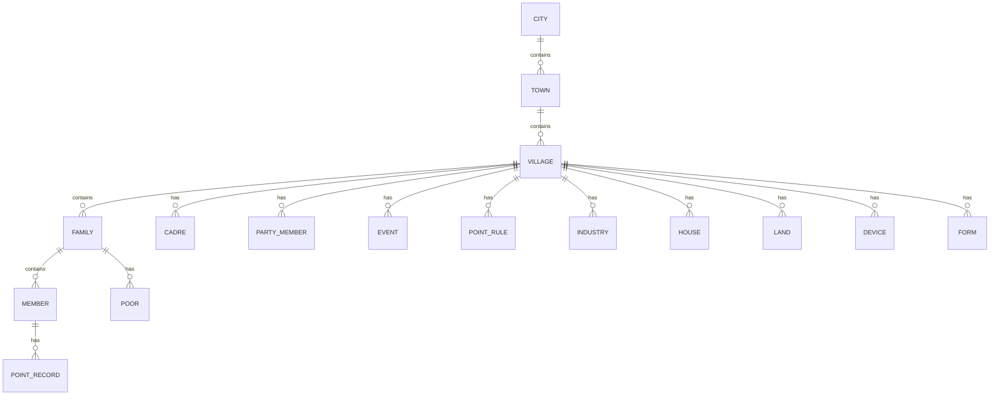

### 7.2 核心数据实体清单

| # | 实体名 | 所属层级 | 数据量级（单村） | 关键字段 |
|---|--------|----------|------------------|----------|
| 1 | 市 | 市 | 1 | 市名称、行政区划代码 |
| 2 | 乡镇 | 镇 | 10-20 | 乡镇名称、所属市、概况 |
| 3 | 村 | 村 | 100-300 | 村名称、所属乡镇、概况、人口、面积 |
| 4 | 队组 | 村 | 10-30 | 队组名称、队组长、户数 |
| 5 | 农户家庭 | 村 | 200-1000 | 户主、家庭编号、住址、人口数、标签 |
| 6 | 家庭成员 | 村 | 500-3000 | 姓名、身份证号、与户主关系、性别 |
| 7 | 村干部 | 村 | 5-15 | 姓名、职务、电话、关联用户 |
| 8 | 党员 | 村 | 30-100 | 姓名、入党时间、党组织、状态 |
| 9 | 党组织 | 乡/村 | 1-5 | 名称、上级组织、负责人 |
| 10 | 三务公开 | 村 | 50-200/年 | 类型、标题、内容、审核状态 |
| 11 | 四议两公开 | 村 | 10-30/年 | 议题、各阶段意见、状态 |
| 12 | 办事指南 | 村 | 20-50 | 标题、分类、流程、材料 |
| 13 | 办事申请 | 村 | 100-500/年 | 申请人、事项、状态、处理结果 |
| 14 | 微网格 | 村 | 5-20 | 名称、网格员、范围、户数 |
| 15 | 事件 | 村 | 100-500/年 | 分类、上报人、状态、处理结果 |
| 16 | 矛盾 | 村 | 10-50/年 | 分类、当事人、调解结果 |
| 17 | 外出务工 | 村 | 50-300 | 姓名、外出地、类型 |
| 18 | 脱贫户 | 村 | 5-50 | 户主、脱贫年份、监测状态 |
| 19 | 产业（6 类） | 村 | 10-50 | 类型、规模、产值 |
| 20 | 企业 | 村 | 5-30 | 名称、类型、产值 |
| 21 | 房屋 | 村 | 200-1000 | 编号、户主、面积、类型 |
| 22 | 土地 | 村 | 100-500 | 编号、类型、面积、承包户 |
| 23 | 设备（5 类） | 村 | 5-30 | 名称、序列号、状态 |
| 24 | 积分规则 | 村 | 20-100 | 名称、分类、分值 |
| 25 | 积分明细 | 村 | 1000-10000/年 | 村民、规则、分值、审核状态 |
| 26 | 商品 | 村 | 20-100 | 名称、兑换积分、库存 |
| 27 | 兑换订单 | 村 | 100-1000/年 | 单号、村民、商品、状态 |
| 28 | 千村千面配置 | 村 | 1-5 | 页面类型、组件 JSON |
| 29 | 表单 | 村/镇 | 10-50 | 名称、字段 JSON、状态 |
| 30 | 表单数据 | 村/镇 | 100-10000 | 表单 ID、提交内容 JSON |
| 31 | 旅游村 | 村 | 0-1 | 名称、简介、状态 |
| 32 | 旅游资源 | 村 | 5-20 | 名称、类型、位置 |
| 33 | 景点 | 村 | 5-20 | 名称、分类、地址 |
| 34 | 认养订单 | 村 | 10-100/年 | 订单号、认养人、品类、状态 |
| 35 | 用户 | 全平台 | 500-5000/村 | 姓名、手机号、角色、所属村 |
| 36 | 开通申请 | 市 | 100-500 | 申请类型、申请村、状态 |
| 37 | 审核记录 | 全平台 | 1000+ | 业务类型、审核人、结果 |

### 7.3 数据流

#### 7.3.1 自上而下数据流

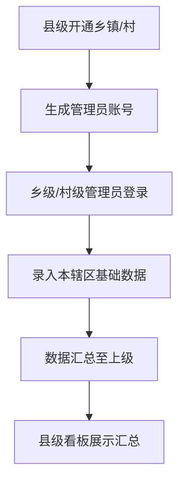

#### 7.3.2 自下而上数据流

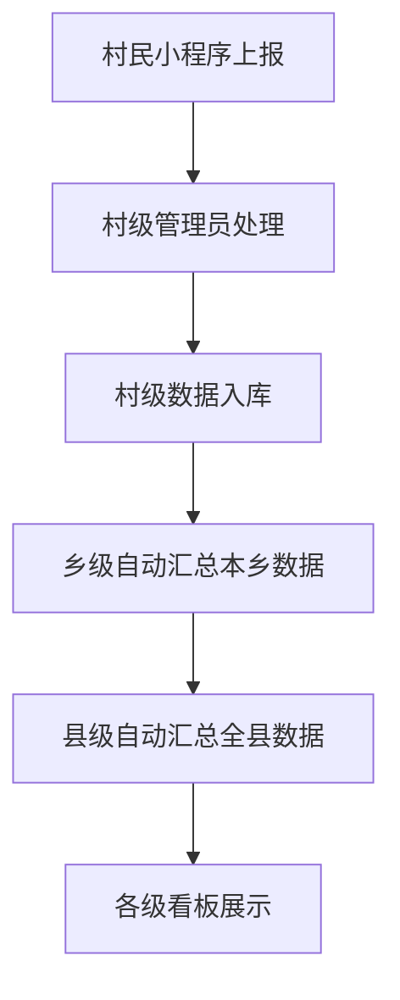

#### 7.3.3 跨端数据流

| 数据对象 | 录入端 | 展示端 |
|----------|--------|--------|
| 三务公开 | 村级 PC | 乡级审核 → 村民小程序、大屏 |
| 事件上报 | 村民小程序、村干部小程序 | 村级 PC、大屏 |
| 积分申请 | 村民小程序 | 村干部小程序审核 → 村民小程序、大屏 |
| 公告通知 | 村级 PC、村干部小程序 | 村民小程序、大屏 |
| 办事申请 | 村民小程序 | 村干部小程序处理 → 村民小程序 |
| 千村千面配置 | 村级 PC | 村民小程序实时下发 |
| 设备画面 | 村级 PC 绑定 | 村民小程序、村干部小程序、大屏 |

### 7.4 数据保留与归档

| 数据类型 | 在线保留 | 归档策略 |
|----------|----------|----------|
| 基础数据（农户、家庭、成员） | 永久 | 不归档 |
| 业务数据（事件、积分、订单） | 3 年 | 3 年后转冷存储 |
| 日志数据 | 1 年 | 1 年后删除 |
| 文件附件 | 与业务数据同步 | 同步归档 |
| 已删除数据 | 回收站保留 30 天 | 30 天后物理删除 |

### 7.5 数据质量要求

| 维度 | 要求 |
|------|------|
| 完整性 | 必填字段填写率 ≥ 95% |
| 准确性 | 身份证号、手机号格式校验通过率 100% |
| 一致性 | 跨端数据同步延迟 ≤ 5 秒 |
| 唯一性 | 身份证号、家庭编号、设备序列号全局唯一 |
| 时效性 | 看板数据延迟 ≤ 5 分钟 |

---

## 8. 配置要求

平台"较大配置性"体现在多个维度，配置项分为"开通配置、业务配置、页面配置、规则配置、设备配置"五类。

### 8.1 开通配置

| 配置项 | 配置位置 | 说明 |
|--------|----------|------|
| 乡镇开通 | 县级-乡村开通管理 | 开通乡镇、生成乡级管理员账号 |
| 村开通 | 县级-乡村开通管理 | 开通村、生成村级管理员账号 |
| 开通审核 | 县级-乡村开通管理 | 审核通过/驳回开通申请 |
| 开通审计 | 县级-乡村开通管理 | 查看开通记录、修改备注 |

### 8.2 业务配置

| 配置项 | 配置位置 | 说明 |
|--------|----------|------|
| 积分规则 | 村级-积分规则配置 | 自定义加减分规则、分类、分值 |
| 积分审核人员 | 村级-积分审核人员 | 指定审核人员及审核范围 |
| 积分兑换规则 | 村级-积分兑换规则 | 兑换类型、积分要求、上限 |
| 商品上下架 | 村级-商品管理 | 商品上架/下架、库存 |
| 旅游村开通 | 村级-旅游村开通 | 开通/关闭本村为旅游村 |
| 认养开通 | 村级-认养开通 | 开通/关闭本村认养业务 |
| 数据字典 | 系统管理 | 字典分类与字典项维护 |

### 8.3 页面配置（千村千面）

| 配置项 | 配置位置 | 说明 |
|--------|----------|------|
| 小程序首页 | 村级-首页设计器 | 拖拽组件、配置属性、保存发布 |
| 小程序更多页 | 村级-更多页面设计器 | 自定义二级页面、专题页 |
| 大屏看板 | 村级-数字看板（默认配置） | 标签页轮播间隔、KPI 指标选择 |
| PC 后台菜单 | 系统管理-菜单管理 | 按角色配置可见菜单 |

### 8.4 规则配置

| 配置项 | 配置位置 | 说明 |
|--------|----------|------|
| 三务公开审核规则 | 系统-流程配置 | 是否需要乡级审核、审核人 |
| 事件分类规则 | 村级-基础治理 | 自定义事件分类、派发规则 |
| 积分自动发放规则 | 村级-积分规则配置 | 部分积分行为是否自动发放（无需审核） |
| 通知推送规则 | 系统-通知配置 | 哪类通知走哪种渠道 |
| 表单提交规则 | 村级-表单应用 | 频次限制、时间窗、登录要求 |

### 8.5 设备配置

| 配置项 | 配置位置 | 说明 |
|--------|----------|------|
| 沃家云视设备 | 村级-沃家云视设备 | 单设备绑定 |
| 雁飞设备 | 村级-雁飞设备 | 单设备添加 |
| 小喇叭设备 | 村级-小喇叭设备 | 新增、音量、播放时段 |
| 萤石云账号 | 村级-萤石云设备 | 账号 + AppKey + Secret 绑定 |
| 乐橙云设备 | 村级-乐橙云设备 | 单设备绑定 |
| 监控公开范围 | 村级-设备管理 | 配置哪些设备对村民公开 |

### 8.6 角色与权限配置

| 配置项 | 配置位置 | 说明 |
|--------|----------|------|
| 角色管理 | 系统管理-角色管理 | 5 个内置角色 + 自定义角色 |
| 菜单权限 | 系统管理-角色管理 | 角色可见菜单配置 |
| 数据权限 | 系统管理-角色管理 | 角色数据范围配置（本村/本乡/全县） |
| 字段权限 | 系统管理-角色管理 | 敏感字段脱敏配置 |

### 8.7 系统参数配置

| 配置项 | 默认值 | 说明 |
|--------|--------|------|
| 列表每页条数 | 10 | 可选 10/20/50 |
| Token 有效期 | 8 小时 | PC 端会话 |
| 小程序 Token | 7 天 | 小程序会话 |
| 大屏刷新间隔 | 5 分钟 | 大屏数据刷新 |
| 大屏轮播间隔 | 60 秒 | 大屏标签页切换 |
| 文件上传大小 | 图片 5MB / 文件 20MB | 单文件大小限制 |
| Excel 导入行数 | 5000 | 单次导入最大行数 |

---

## 9. 非功能要求

### 9.1 性能要求

| 指标 | 要求 |
|------|------|
| PC 管理端首屏加载 | ≤ 3 秒（1080P 网络） |
| 小程序冷启动 | ≤ 5 秒 |
| 列表查询响应 | ≤ 2 秒（万级数据） |
| 大屏端首屏渲染 | ≤ 5 秒 |
| 大屏端图表渲染 | ≤ 2 秒 |
| 表单提交响应 | ≤ 1 秒 |
| 文件上传 5MB | ≤ 10 秒 |
| 并发用户数 | 单村同时在线 ≥ 50；全县 ≥ 5000 |
| 数据库查询 | 单表百万级数据查询 ≤ 1 秒（有索引） |

### 9.2 可用性要求

| 指标 | 要求 |
|------|------|
| 系统可用性 | ≥ 99.5% |
| 单点故障恢复 | ≤ 30 分钟 |
| 数据备份频率 | 每日全量 + 实时增量 |
| 数据恢复 RTO | ≤ 4 小时 |
| 数据恢复 RPO | ≤ 1 小时 |
| 计划停机 | 提前 24 小时通知 |

### 9.3 安全要求

| 类别 | 要求 |
|------|------|
| 传输安全 | 全站 HTTPS，TLS 1.2+ |
| 密码安全 | bcrypt 加盐存储，强度校验（8 位+字母+数字） |
| SQL 注入防护 | 参数化查询，ORM 框架 |
| XSS 防护 | 输入过滤 + 输出转义 |
| CSRF 防护 | Token 校验 |
| 文件上传安全 | 类型白名单 + 病毒扫描 |
| 接口安全 | JWT Token + 接口签名 |
| 越权防护 | 每个接口校验数据权限 |
| 敏感数据脱敏 | 身份证号、手机号列表脱敏显示 |
| 操作审计 | 关键操作 100% 留痕 |
| 等保要求 | 满足等保三级要求 |

### 9.4 兼容性要求

| 端 | 兼容范围 |
|----|----------|
| PC 管理端 | Chrome 90+、Edge 90+、Firefox 88+、Safari 14+ |
| 大屏端 | Chrome 90+（推荐），1920×1080 起步 |
| 村民小程序 | 微信 8.0+，iOS 12+，Android 7.0+ |
| 村干部小程序 | 微信 8.0+，iOS 12+，Android 7.0+ |

### 9.5 可扩展性要求

| 维度 | 要求 |
|------|------|
| 横向扩展 | 应用层无状态，支持负载均衡横向扩容 |
| 数据库扩展 | 支持读写分离、分库分表预留 |
| 模块扩展 | 业务模块松耦合，新增模块不影响现有模块 |
| 字段扩展 | 农户家庭、成员支持扩展信息字段动态扩展 |
| 设备接入 | 设备接入采用适配器模式，新增品牌仅需实现适配器 |

### 9.6 可维护性要求

| 维度 | 要求 |
|------|------|
| 代码规范 | 遵循 ESLint + Prettier 规范 |
| 日志规范 | 统一日志格式，分级别（DEBUG/INFO/WARN/ERROR） |
| 监控告警 | 应用、数据库、接口监控，异常告警 |
| 文档完备 | 接口文档、部署文档、运维手册齐全 |
| 配置外置 | 环境变量、配置文件外置，不硬编码 |

### 9.7 移动端适配

| 维度 | 要求 |
|------|------|
| 小程序屏幕适配 | 适配 iPhone SE ~ iPhone 15 Pro Max、主流 Android 机型 |
| 触摸友好 | 最小点击区域 44×44 px |
| 弱网适配 | 弱网下展示骨架屏、支持离线缓存 |
| 图片优化 | 图片懒加载、WebP 格式、CDN 加速 |

---

## 10. 技术架构

### 10.1 总体架构

系统采用前后端分离 + 微服务化的总体架构，分为：客户端层、网关层、应用服务层、数据层、第三方集成层。

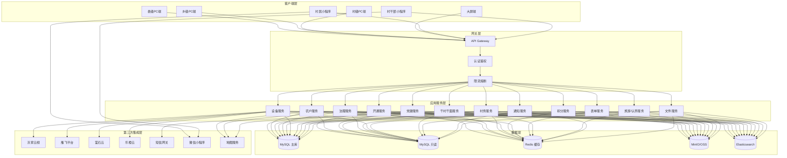

### 10.2 前端架构

#### 10.2.1 技术选型

| 端 | 技术栈 | 说明 |
|----|--------|------|
| PC 管理端（县/乡/村） | Vue 3 + Vite + Element Plus + Pinia + Vue Router | 单页应用，按角色路由 |
| 大屏端 | Vue 3 + ECharts 5 + WebSocket | 1920×1080 适配 |
| 村民小程序 | 微信小程序原生 + WeUI | 兼容微信生态 |
| 村干部小程序 | 微信小程序原生 + WeUI | 兼容微信生态 |
| 共享样式 | Tailwind CSS + Design Tokens | `html/shared/tokens.css` |

#### 10.2.2 PC 管理端架构


- **路由层**：基于 Vue Router 4，按角色配置路由守卫
- **布局层**：侧边栏 + 顶栏 + 内容区，参考 `html/admin/index.html`
- **页面层**：按业务模块组织（县级 4 个、乡级 9 个、村级 16 个）
- **组件层**：列表组件、表单组件、地图组件、图表组件、富文本组件等公共组件
- **API 层**：Axios 封装，统一拦截器处理 Token、错误、loading
- **工具层**：日期、格式化、校验、加密、下载等工具函数

#### 10.2.3 大屏端架构

- 基于 ECharts 5.x 渲染所有图表
- 通过 WebSocket 接收实时数据推送
- 通过 Design Tokens 统一深蓝主色调
- 标签页切换、自动轮播、全屏控制

#### 10.2.4 小程序架构

- 原生微信小程序开发，无跨端框架
- 与 PC 端共用同一套后端 API
- 千村千面配置通过 API 拉取后动态渲染首页

#### 10.2.5 共享资源

| 文件 | 作用 |
|------|------|
| `html/shared/tokens.css` | Design Tokens 变量定义 |
| `html/shared/js/icons-local.js` | 本地 SVG 图标库 |
| `html/shared/js/iconify-icon.min.js` | Iconify 图标库（PC 端） |

### 10.3 后端架构

#### 10.3.1 技术选型

| 组件 | 技术 | 说明 |
|------|------|------|
| 开发框架 | Spring Boot 3.x | 微服务基座 |
| 微服务框架 | Spring Cloud Alibaba | 服务治理 |
| 注册中心 | Nacos | 服务注册与配置中心 |
| API 网关 | Spring Cloud Gateway | 统一入口 |
| 认证 | Spring Security + JWT | 鉴权 |
| ORM | MyBatis-Plus | 数据访问 |
| 任务调度 | XXL-Job | 定时任务 |
| 消息队列 | RocketMQ | 异步解耦 |
| 缓存 | Redis 7 | 缓存与会话 |
| 全文搜索 | Elasticsearch 8 | 日志、全文检索 |
| 文件存储 | MinIO 或阿里云 OSS | 文件存储 |
| 接口文档 | SpringDoc OpenAPI 3 | API 文档 |

#### 10.3.2 服务划分

| 服务名 | 职责 | 主要实体 |
|--------|------|----------|
| 开通服务 | 乡镇/村开通、审核、审计 | 开通申请、审核记录 |
| 用户服务 | 用户、角色、权限、登录 | 用户、角色、权限 |
| 农户服务 | 农户家庭、成员、队组 | 家庭、成员、队组 |
| 党建服务 | 党组织、党员、三会一课、党委 | 党组织、党员、会议 |
| 村务服务 | 三务公开、四议两公开、办事指南 | 公开内容、议题、指南 |
| 治理服务 | 微网格、事件、矛盾、外出务工 | 网格、事件、矛盾 |
| 积分服务 | 积分规则、积分明细、商品、订单 | 规则、明细、商品、订单 |
| 设备服务 | 5 类设备接入与流媒体 | 设备、视频流 |
| 表单服务 | 表单设计、提交、经办 | 表单、表单数据 |
| 千村千面服务 | 页面配置、组件管理 | 页面配置、组件 |
| 旅游认养服务 | 旅游村、资源、景点、认养 | 旅游村、资源、认养 |
| 通知服务 | 站内消息、短信、推送 | 消息、推送记录 |
| 文件服务 | 文件上传、下载、转码 | 文件元数据 |
| 数据看板服务 | 各维度数据聚合 | 聚合视图 |

#### 10.3.3 接口规范

- 所有接口 RESTful 风格，统一前缀 `/api/v1`
- 统一响应格式：`{ code, message, data, traceId }`
- 统一错误码：业务错误码 5 位数字
- 分页接口统一参数：`page`、`size`、`keyword`、`status`、`startDate`、`endDate`
- 文件上传采用分片上传，大文件支持断点续传

### 10.4 数据库设计

#### 10.4.1 数据库选型

- 主库：MySQL 8.x，InnoDB 引擎，utf8mb4 字符集
- 只读库：MySQL 8.x 只读副本（看板查询用）
- 缓存：Redis 7（会话、热点数据、分布式锁）
- 文件：MinIO 或阿里云 OSS
- 全文搜索：Elasticsearch 8（日志、全文检索）

#### 10.4.2 数据库设计原则

- 所有业务表含 `id`（ bigint 自增）、`create_time`、`update_time`、`create_by`、`update_by`、`deleted`（软删除）6 个通用字段
- 所有业务表含 `village_id`（村 ID）、`town_id`（镇 ID）、`city_id`（市 ID）三个行政区划字段，用于数据权限隔离
- 编号类字段加唯一索引
- 外键关联字段加普通索引
- 状态字段加索引
- 大字段（富文本、JSON）单独拆表或使用 JSON 类型

#### 10.4.3 分库分表策略

| 数据 | 策略 |
|------|------|
| 基础数据（农户、家庭、成员） | 单库，按 `village_id` 索引 |
| 业务数据（事件、积分、订单） | 单库，按 `village_id` + `create_time` 索引 |
| 日志数据 | 按月分表 `log_202608` |
| 千村千面配置 | 单库，配置数据量小 |
| 表单数据 | 按 `village_id` 分表，单村数据量大时启用 |

### 10.5 部署架构

```mermaid
graph TB
    subgraph "客户端"
        U1[PC 浏览器]
        U2[大屏]
        U3[微信小程序]
    end

    subgraph "CDN"
        CDN[CDN 加速]
    end

    subgraph "负载均衡"
        LB[Nginx 负载均衡]
    end

    subgraph "应用集群"
        A1[应用实例 1]
        A2[应用实例 2]
        A3[应用实例 N]
    end

    subgraph "数据库集群"
        DB1[(MySQL 主)]
        DB2[(MySQL 从)]
        R[(Redis 哨兵)]
        ES[(ES 集群)]
    end

    subgraph "存储"
        OSS[(MinIO/OSS)]
    end

    U1 & U2 & U3 --> CDN --> LB
    LB --> A1 & A2 & A3
    A1 & A2 & A3 --> DB1
    DB1 --> DB2
    A1 & A2 & A3 --> R
    A1 & A2 & A3 --> ES
    A1 & A2 & A3 --> OSS
```

### 10.6 集成架构

#### 10.6.1 设备接入适配器

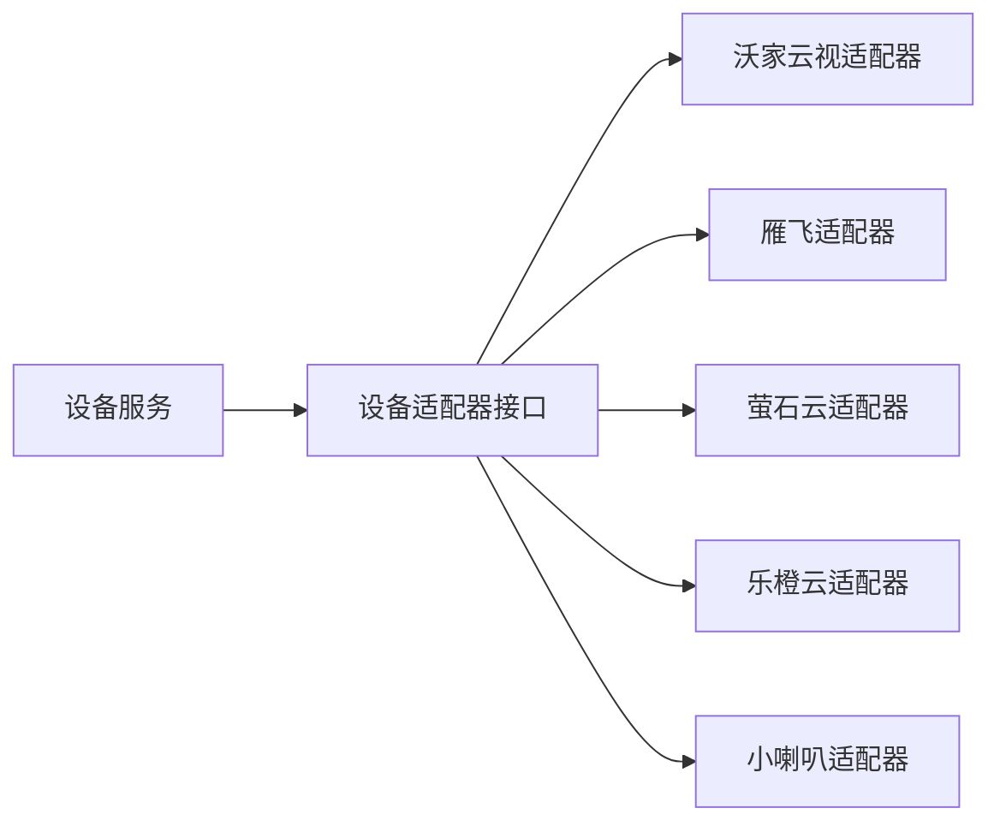

每个适配器实现统一接口：
- `bindDevice(config)` 绑定设备
- `getDeviceList()` 拉取设备列表
- `getLiveStream(deviceId)` 获取实时视频流
- `getDeviceStatus(deviceId)` 获取设备状态

#### 10.6.2 第三方平台集成

| 第三方 | 用途 | 集成方式 |
|--------|------|----------|
| 微信小程序 | 小程序登录、消息推送 | 微信开放平台 API |
| 短信网关 | 验证码、紧急通知 | 阿里云短信 / 腾讯云短信 |
| 地图服务 | 地图标注、定位 | 高德地图 / 百度地图 |
| 沃家云视 | 视频监控 | 开放 API |
| 萤石云 | 视频监控 | 开放 API |
| 乐橙云 | 视频监控 | 开放 API |
| 雁飞 | 视频监控/传感 | 开放 API |

### 10.7 关键技术决策

| 决策点 | 选型 | 理由 |
|--------|------|------|
| 前端框架 | Vue 3 | 生态成熟，团队熟悉 |
| UI 库 | Element Plus | 后台管理生态完善 |
| 图表库 | ECharts 5 | 大屏可视化首选 |
| 小程序 | 原生 | 性能最优，无需跨端 |
| 微服务 | Spring Cloud Alibaba | 国内生态完善 |
| 数据库 | MySQL | 关系型数据首选 |
| 缓存 | Redis | 行业标准 |
| 文件存储 | MinIO/OSS | 私有化/公有云双支持 |

---

## 11. 运维部署

### 11.1 部署架构

#### 11.1.1 部署模式

平台支持两种部署模式：

| 模式 | 适用场景 | 说明 |
|------|----------|------|
| 私有化部署 | 县级自建机房 | 全套组件部署在客户机房 |
| 公有云部署 | 县级采购云服务 | 部署在阿里云/腾讯云/华为云 |

#### 11.1.2 环境划分

| 环境 | 用途 | 数据 |
|------|------|------|
| 开发环境 | 日常开发 | Mock 数据 |
| 测试环境 | 功能测试 | 测试数据 |
| 预发布环境 | 上线前验证 | 生产数据脱敏 |
| 生产环境 | 对外服务 | 真实数据 |

### 11.2 部署清单

#### 11.2.1 私有化部署最小配置

| 节点 | 数量 | 配置 | 用途 |
|------|------|------|------|
| 应用服务器 | 2 | 8C 16G 100G | 应用集群 |
| 数据库服务器 | 2 | 8C 32G 500G SSD | MySQL 主从 |
| 缓存服务器 | 3 | 4C 8G 100G | Redis 哨兵 |
| 文件服务器 | 1 | 4C 8G 1T | MinIO |
| 搜索服务器 | 3 | 4C 16G 200G | ES 集群 |
| 负载均衡 | 1 | 4C 8G | Nginx |
| 监控服务器 | 1 | 4C 8G 200G | Prometheus + Grafana |
| 大屏服务器 | 1 | 4C 8G | 大屏展示 |
| **合计** | **14** | — | — |

#### 11.2.2 公有云部署推荐配置

| 服务 | 规格 | 数量 | 说明 |
|------|------|------|------|
| ECS 应用 | 8C 16G | 2-4 | 应用集群，可弹性扩容 |
| RDS MySQL | 8C 32G 500G | 1 主 1 从 | 高可用版 |
| Redis | 8G | 1 哨兵 3 节点 | 标准版 |
| OSS | 按量 | — | 文件存储 |
| ES | 4C 16G | 3 节点 | 日志检索 |
| SLB | 按量 | — | 负载均衡 |
| CDN | 按量 | — | 静态资源加速 |
| 短信 | 按量 | — | 短信服务 |

### 11.3 部署流程

```mermaid
flowchart TD
    A[代码合并到 main 分支] --> B[CI 自动构建]
    B --> C[单元测试 + 静态检查]
    C --> D{测试通过}
    D -->|否| E[通知开发修复]
    D -->|是| F[构建 Docker 镜像]
    F --> G[推送到镜像仓库]
    G --> H[部署到测试环境]
    H --> I[集成测试]
    I --> J{测试通过}
    J -->|否| E
    J -->|是| K[部署到预发布]
    K --> L[UAT 验证]
    L --> M{验收通过}
    M -->|否| E
    M -->|是| N[部署到生产]
    N --> O[冒烟测试]
    O --> P[上线完成]
```

### 11.4 容器化部署

#### 11.4.1 Docker 镜像

- 基础镜像：`eclipse-temurin:17-jre`
- 镜像命名：`registry.example.com/digitalvillage/{service}:{version}`
- 镜像大小：单个服务约 300MB
- 多阶段构建：构建阶段用 Maven，运行阶段用 JRE

#### 11.4.2 Kubernetes 部署（可选）

| 资源 | 配置 |
|------|------|
| Deployment | 每个服务 2 副本，滚动更新 |
| Service | ClusterIP |
| Ingress | Nginx Ingress |
| ConfigMap | 配置外置 |
| Secret | 密钥管理 |
| HPA | CPU > 70% 自动扩容 |
| PVC | 日志持久化 |

### 11.5 监控告警

#### 11.5.1 监控体系

| 层级 | 工具 | 监控内容 |
|------|------|----------|
| 主机监控 | Prometheus + Node Exporter | CPU、内存、磁盘、网络 |
| 应用监控 | Spring Boot Actuator + Micrometer | JVM、QPS、响应时间 |
| 数据库监控 | Prometheus + MySQL Exporter | 连接数、慢查询、QPS |
| Redis 监控 | Prometheus + Redis Exporter | 命中率、内存、连接数 |
| 接口监控 | SkyWalking | 链路追踪、接口性能 |
| 日志监控 | ELK | 错误日志、业务日志 |
| 大屏监控 | Grafana | 业务指标可视化 |

#### 11.5.2 告警规则

| 指标 | 阈值 | 告警级别 |
|------|------|----------|
| CPU 使用率 | > 80% 持续 5 分钟 | P2 |
| 内存使用率 | > 85% 持续 5 分钟 | P2 |
| 磁盘使用率 | > 90% | P1 |
| 应用不可用 | 健康检查失败 3 次 | P0 |
| 接口响应时间 | > 5 秒持续 1 分钟 | P2 |
| 数据库连接数 | > 80% 最大连接 | P1 |
| 慢查询 | > 3 秒 | P3 |
| Redis 内存 | > 90% | P1 |

#### 11.5.3 告警渠道

- P0/P1：电话 + 短信 + 钉钉/飞书
- P2：短信 + 钉钉/飞书
- P3：钉钉/飞书

### 11.6 备份与恢复

#### 11.6.1 备份策略

| 备份对象 | 备份方式 | 频率 | 保留 |
|----------|----------|------|------|
| MySQL 数据 | 全量 + Binlog 增量 | 每日全量 + 实时增量 | 30 天 |
| Redis 数据 | RDB + AOF | 每日 RDB + 实时 AOF | 7 天 |
| MinIO 文件 | 跨区域复制 | 实时 | 永久 |
| 配置文件 | Git 仓库 | 实时 | 永久 |
| 镜像 | 镜像仓库 | 每次构建 | 10 个版本 |

#### 11.6.2 恢复演练

- 每季度进行一次恢复演练
- 演练记录归档，含恢复时长、问题、改进措施
- RTO ≤ 4 小时，RPO ≤ 1 小时

### 11.7 升级与回滚

#### 11.7.1 升级流程

1. 发布升级公告（提前 24 小时）
2. 数据库迁移脚本执行
3. 应用滚动升级（K8s）或蓝绿部署
4. 冒烟测试
5. 升级完成通知

#### 11.7.2 回滚策略

| 回滚类型 | 策略 |
|----------|------|
| 应用回滚 | 切换到上一版本镜像 |
| 数据库回滚 | Binlog 回放到升级前时间点 |
| 配置回滚 | Git revert |

### 11.8 安全运维

| 项目 | 要求 |
|------|------|
| 漏洞扫描 | 每月一次，CVSS ≥ 7.0 限期修复 |
| 渗透测试 | 每半年一次 |
| 安全补丁 | 高危 24 小时内、中危 7 天内、低危 30 天内 |
| 账号管理 | 离职 24 小时内禁用账号 |
| 密码策略 | 90 天强制修改，不可与最近 5 次重复 |
| 操作审计 | 关键操作 100% 留痕，日志保留 1 年 |
| 数据脱敏 | 生产数据导出需审批并脱敏 |

---

## 12. 附录

### 12.1 术语表

| 术语 | 说明 |
|------|------|
| 三级 | 市（县）—乡镇—村三级体系 |
| 四端 | PC 管理端、大屏端、村民小程序、村干部小程序 |
| 三务公开 | 党务公开、村务公开、财务公开 |
| 四议两公开 | 党支部会提议、两委务会商议、党员大会审议、村民代表会议决议；决议公开、实施结果公开 |
| 三会一课 | 支部党员大会、支部委员会、党小组会、党课 |
| 千村千面 | 平台核心配置能力，支持每村自定义小程序页面 |
| 微网格 | 在村域内进一步细分的治理单元 |
| 沃家云视 | 中国联通视频监控平台 |
| 雁飞 | 中国移动物联网平台 |
| 萤石云 | 海康威视视频云平台 |
| 乐橙云 | 大华视频云平台 |
| Design Tokens | 设计令牌，统一管理颜色、字号、间距等样式变量 |

### 12.2 截图清单索引

| 层级 | 文件夹 | 模块数 | 截图数 |
|------|--------|--------|--------|
| 县级 | `1-县级` | 4 | 约 30 张 |
| 乡级 | `2-乡级` | 9 | 约 150 张 |
| 村级 | `3-村级` | 15 | 约 350 张 |
| **合计** | — | 28 | 约 530 张 |

### 12.3 现有原型清单

| 原型目录 | 端 | 文件数 | 说明 |
|----------|----|--------|------|
| `html/admin/` | 村级 PC 管理端 | 1+ | 后台管理入口（参考用，待按本说明书扩展） |
| `html/dashboard/` | 大屏端 | 1+ | 数字看板入口 |
| `html/villager/` | 村民小程序 | 30+ | 完整村民小程序原型 |
| `html/cadre/` | 村干部小程序 | 30+ | 完整村干部小程序原型 |
| `html/shared/` | 共享资源 | 3+ | tokens.css、icons-local.js、iconify-icon.min.js |

### 12.4 优先级说明

| 优先级 | 说明 |
|--------|------|
| P0 | 必须实现，MVP 范围 |
| P1 | 重要，二期范围 |
| P2 | 可选，三期范围 |

### 12.5 版本规划建议

| 版本 | 范围 | 说明 |
|------|------|------|
| V1.0（MVP） | 县/乡/村三级 PC 端 + 村民小程序 + 村干部小程序核心功能 | P0 优先级模块 |
| V2.0 | 大屏端 + 千村千面 + 表单应用 + 旅游 + 认养 | P0 + P1 模块 |
| V3.0 | 设备接入扩展、智慧农业、生态数据对接 | P2 模块 |

### 12.6 与现有原型的扩展关系

需求说明书.md 完成后，将作为后续本项目原型扩展和开发的依据：

| 现有原型 | 扩展方向 | 对应需求章节 |
|----------|----------|--------------|
| `html/admin/` | 从村级后台扩展为县/乡/村三级 PC 管理端 | 6.1、6.2、6.3 |
| `html/dashboard/` | 完善 6 个标签页内容、增加乡级大屏 | 6.4 |
| `html/villager/` | 完善千村千面下发、农产品集市、积分商城 | 6.5 |
| `html/cadre/` | 完善任务、巡查、积分审核、诉求处理闭环 | 6.6 |
| `html/shared/` | 持续维护 Design Tokens、组件库 | 6.7、10.2 |

### 12.7 修订记录

| 版本 | 日期 | 修订人 | 修订内容 |
|------|------|--------|----------|
| V1.0 | 2026-07 | — | 初版《数字乡村（村级版）需求说明书》 |
| V2.0 | 2026-08-09 | 数字乡村项目组 | 重构为县/乡/村三级 + 四端统一版，替代 V1.0 |

---

**文档结束**

